# Results

Generated by `cargo xtask report` from `results/`; do not edit. `cargo xtask report --check` fails when this file, the figures or `verdict.json` differ from what `results/` generates. The method is in the [repository README](../README.md), and so is the commentary.

## Verdict

| Entry point | Crate | Add to Kynos? | Deserves to exist? | Why |
| --- | --- | --- | --- | --- |
| `serde_json` | serde_json | baseline | yes — the baseline | the baseline every entry is weighed against |
| `serde_json+float_roundtrip` | serde_json | ❌ fail | yes — Correctly rounded float parsing, which the default parser is not (see conformance, numbers). | not on the frontier with a CPU or heap win beyond ε and the A/A band, corroborated at v3, on any Kynos shape |
| `sonic-rs` | sonic-rs | ❌ fail | yes — long-string encode CPU 0.11× serde_json at native (cycles) (0.07× at v3 (est. cycles)), provisional (solo). Lazy path lookups without a full parse (`get`, `get_many`, `LazyValue`); errors carry a byte offset as well as line and column. | grammar n_string_invalid_unicode_escape.json#ignored/owned#unique fails 4 of 4 conformance runs |
| `simd-json` | simd-json | ❌ fail | yes — reject-truncated decode CPU 0.10× serde_json at native (cycles) (0.12× at v3 (est. cycles)), provisional (solo). Borrowing decode of escaped strings, unescaped in place: 1,175 allocations against serde_json's 4,584 for twitter-like into borrowed types from a unique buffer, though 5.54 MB against serde_json's 734 kB. A tape API (`to_tape`) traverses without building values. | status shape/u64-out-of-range fails 4 of 4 conformance runs; fuzz decode_struct (v3); fuzz decode_value (v3) |
| `simd-json-buffers` | simd-json | ❌ fail | yes (provisional) — reject-truncated decode CPU 0.07× serde_json at native (cycles) (0.11× at v3 (est. cycles)), provisional (solo) | status shape/u64-out-of-range fails 4 of 4 conformance runs; fuzz decode_struct (v3); fuzz decode_value (v3) |
| `flexon-rt` | flexon | ❌ fail | yes (provisional) — long-string encode CPU 0.21× serde_json at native (cycles) (0.23× at v3 (est. cycles)), provisional (solo) | grammar n_array_comma_after_close.json#value/owned#unique fails 4 of 4 conformance runs; refuses what serde_json decodes on keys-long-int decode (13 cells); wrong result on reject-shape decode (13 cells); Miri reports undefined behavior (in-bounds pointer arithmetic failed); 2 more fuzz divergences |
| `flexon-rt-mut` | flexon | ❌ fail | yes — long-string encode CPU 0.22× serde_json at native (cycles) (0.23× at v3 (est. cycles)), provisional (solo). In-place parse (`from_mut_slice`) lets escaped strings borrow, which serde_json cannot: 1,170 allocations and 558 kB against serde_json's 4,584 and 734 kB for twitter-like into borrowed types from a unique buffer. | grammar n_array_comma_after_close.json#value/owned#unique fails 4 of 4 conformance runs; refuses what serde_json decodes on keys-long-int decode (13 cells); wrong result on reject-shape decode (13 cells); Miri reports undefined behavior (in-bounds pointer arithmetic failed); 2 more fuzz divergences |
| `flexon-ct` | flexon | ❌ fail | yes (provisional) — long-string encode CPU 0.22× serde_json at native (cycles) (0.23× at v3 (est. cycles)), provisional (solo) | grammar n_array_comma_after_close.json#value/owned#unique fails 4 of 4 conformance runs; refuses what serde_json decodes on keys-long-int decode (13 cells); wrong result on reject-shape decode (13 cells); Miri reports undefined behavior (in-bounds pointer arithmetic failed); 2 more fuzz divergences |
| `flexon-ct-mut` | flexon | ❌ fail | yes — long-string encode CPU 0.22× serde_json at native (cycles) (0.23× at v3 (est. cycles)), provisional (solo). In-place parse (`from_mut_slice`) lets escaped strings borrow, which serde_json cannot: 1,170 allocations and 558 kB against serde_json's 4,584 and 734 kB for twitter-like into borrowed types from a unique buffer. | grammar n_array_comma_after_close.json#value/owned#unique fails 4 of 4 conformance runs; refuses what serde_json decodes on keys-long-int decode (13 cells); wrong result on reject-shape decode (13 cells); Miri reports undefined behavior (in-bounds pointer arithmetic failed); 2 more fuzz divergences |
| `jiter` | jiter | ❌ fail | yes — long-string decode CPU 0.47× serde_json at native (cycles) (0.53× at v3 (est. cycles)), provisional (solo). Partial mode parses truncated documents (built for streamed model output); decode only. | status shape/negative-zero-into-u64 fails 4 of 4 conformance runs; refuses what serde_json decodes on ints decode (13 cells); refuses what serde_json decodes on ints-extremes decode (13 cells); 3 more fuzz divergences |
| `hifijson` | hifijson | ❌ fail | yes — 0 `unsafe` blocks, 0 `unsafe` functions and 0 `unsafe` impls across its 1 runtime crate(s), against serde_json's own (see costs). | reference point: does not borrow strings from the body |
| `struson` | struson | ❌ fail | yes — sweep-64b encode heap 0.70× serde_json at native, provisional (solo). 0 `unsafe` blocks, 0 `unsafe` functions and 0 `unsafe` impls across its 5 runtime crates. A true streaming reader and writer, with JSON-path seeking. | reference point: does not borrow strings from the body |

## The decision rule, entry by entry

| Entry point | 1 Frontier | 2 Conformance | 3 Soundness | 4 End to end |
| --- | --- | --- | --- | --- |
| `serde_json+float_roundtrip` | ❌ not on the frontier with a CPU or heap win beyond ε and the A/A band, corroborated at v3, on any Kynos shape | ⏳ not run through conformance or fuzzing as a backend of its own | ✅ no advisory at advisory-db e2111519 | ❌ no route ≥10 % better in throughput or p99 beyond the A/A band |
| `sonic-rs` | ⏳ provisional pass: echo-post encode CPU 0.24× at native (cycles) (solo); awaits a quiet-host rerun | ❌ grammar n_string_invalid_unicode_escape.json#ignored/owned#unique fails 4 of 4 conformance runs | ✅ no advisory at advisory-db e2111519 | ⏳ provisional pass: json-large-post +28 % rps, p99 -45 % (solo); awaits a quiet-host rerun |
| `simd-json` | ⏳ provisional pass: echo-post encode CPU 0.29× at native (cycles) (solo); awaits a quiet-host rerun | ❌ status shape/u64-out-of-range fails 4 of 4 conformance runs; fuzz decode_struct (v3); fuzz decode_value (v3) | ✅ no advisory at advisory-db e2111519 | ⏳ provisional pass: json-large-post +19 % rps, p99 -37 % (solo); awaits a quiet-host rerun |
| `simd-json-buffers` | ⏳ provisional pass: echo-post encode CPU 0.29× at native (cycles) (solo); awaits a quiet-host rerun | ❌ status shape/u64-out-of-range fails 4 of 4 conformance runs; fuzz decode_struct (v3); fuzz decode_value (v3) | ✅ no advisory at advisory-db e2111519 | ⏳ provisional pass: json-large-post +21 % rps, p99 -35 % (solo); awaits a quiet-host rerun |
| `flexon-rt` | ⏳ provisional pass: echo-post encode CPU 0.44× at native (cycles) (solo); awaits a quiet-host rerun | ❌ grammar n_array_comma_after_close.json#value/owned#unique fails 4 of 4 conformance runs; refuses what serde_json decodes on keys-long-int decode (13 cells); wrong result on reject-shape decode (13 cells); Miri reports undefined behavior (in-bounds pointer arithmetic failed); 2 more fuzz divergences | ✅ no advisory at advisory-db e2111519 | ⏳ provisional pass: json-large-post +42 % rps, p99 -52 % (solo); awaits a quiet-host rerun |
| `flexon-rt-mut` | ⏳ provisional pass: echo-post encode CPU 0.43× at native (cycles) (solo); awaits a quiet-host rerun | ❌ grammar n_array_comma_after_close.json#value/owned#unique fails 4 of 4 conformance runs; refuses what serde_json decodes on keys-long-int decode (13 cells); wrong result on reject-shape decode (13 cells); Miri reports undefined behavior (in-bounds pointer arithmetic failed); 2 more fuzz divergences | ✅ no advisory at advisory-db e2111519 | ⏳ provisional pass: json-large-post +45 % rps, p99 -51 % (solo); awaits a quiet-host rerun |
| `flexon-ct` | ⏳ provisional pass: echo-post encode CPU 0.43× at native (cycles) (solo); awaits a quiet-host rerun | ❌ grammar n_array_comma_after_close.json#value/owned#unique fails 4 of 4 conformance runs; refuses what serde_json decodes on keys-long-int decode (13 cells); wrong result on reject-shape decode (13 cells); Miri reports undefined behavior (in-bounds pointer arithmetic failed); 2 more fuzz divergences | ✅ no advisory at advisory-db e2111519 | ⏳ provisional pass: json-large-post +51 % rps, p99 -56 % (solo); awaits a quiet-host rerun |
| `flexon-ct-mut` | ⏳ provisional pass: echo-post encode CPU 0.42× at native (cycles) (solo); awaits a quiet-host rerun | ❌ grammar n_array_comma_after_close.json#value/owned#unique fails 4 of 4 conformance runs; refuses what serde_json decodes on keys-long-int decode (13 cells); wrong result on reject-shape decode (13 cells); Miri reports undefined behavior (in-bounds pointer arithmetic failed); 2 more fuzz divergences | ✅ no advisory at advisory-db e2111519 | ⏳ provisional pass: json-large-post +54 % rps, p99 -56 % (solo); awaits a quiet-host rerun |
| `jiter` | ⏳ provisional pass: echo-post decode CPU 0.65× at native (cycles) (solo); awaits a quiet-host rerun | ❌ status shape/negative-zero-into-u64 fails 4 of 4 conformance runs; refuses what serde_json decodes on ints decode (13 cells); refuses what serde_json decodes on ints-extremes decode (13 cells); 3 more fuzz divergences | ✅ no advisory at advisory-db e2111519 | ❌ no route ≥10 % better in throughput or p99 beyond the A/A band |
| `hifijson` | ❌ not on the frontier with a CPU or heap win beyond ε and the A/A band, corroborated at v3, on any Kynos shape | ❌ status shape/valid fails 4 of 4 conformance runs; refuses what serde_json decodes on canada-like decode (14 cells); refuses what serde_json decodes on citm-like decode (14 cells); refuses what serde_json decodes on defaults decode (13 cells); refuses what serde_json decodes on enums decode (13 cells); refuses what serde_json decodes on keys-long-int decode (13 cells); refuses what serde_json decodes on pretty-twitter-like decode (14 cells); refuses what serde_json decodes on raw-utf8 decode (14 cells); refuses what serde_json decodes on sparse decode (13 cells); refuses what serde_json decodes on twitter-like decode (14 cells); wrong result on reject-shape decode (13 cells); 2 more fuzz divergences | ✅ no advisory at advisory-db e2111519 | ❌ no route ≥10 % better in throughput or p99 beyond the A/A band |
| `struson` | ❌ not on the frontier with a CPU or heap win beyond ε and the A/A band, corroborated at v3, on any Kynos shape | ❌ status shape/variant-wrong-type fails 4 of 4 conformance runs; refuses what serde_json decodes on floats decode (13 cells); fuzz decode_value (v3); 1 more fuzz divergence | ✅ no advisory at advisory-db e2111519 | ❌ no route ≥10 % better in throughput or p99 beyond the A/A band |

## CPU per operation at the Kynos shapes: decode

serde_json is the absolute figure; every other column is a ratio to it (below 1 is faster). Owned decode of one shared frame, and `to_vec` encode: what a server does. The rule reads `native (cycles)`, hardware cycles, with the A/A column (serde_json's second copy: the ratio of the medians, and in brackets the margin the rule applies: ε, or the band (the widest gap in the medians or any one round) where wider) as its noise floor; `v3 (est. cycles)` is callgrind's deterministic count, which corroborates it. The instruction rows are the same builds counted as instructions.

| Workload | Point | serde_json | A/A | `serde_json+float_roundtrip` | `sonic-rs` | `simd-json` | `simd-json-buffers` | `flexon-rt` | `flexon-rt-mut` | `flexon-ct` | `flexon-ct-mut` | `jiter` | `hifijson` | `struson` |
| --- | --- | --- | --- | --- | --- | --- | --- | --- | --- | --- | --- | --- | --- | --- |
| json-small | native (cycles) | 1004 | 1.01× (±5.0 %) | 1.05× | 0.77× | 1.21× | 0.99× | 0.62× | 0.66× | 0.63× | 0.65× | 0.97× | 1.10× | 3.78× |
| json-small | native (instructions) | 3759 | 1.00× (±5.0 %) | 1.01× | 0.81× | 1.23× | 0.83× | 0.70× | 0.71× | 0.69× | 0.70× | 0.89× | 1.19× | 3.64× |
| json-small | v3 (est. cycles) | 3996 | exact | 1.01× | 0.82× | 1.30× | 0.87× | 0.72× | 0.74× | 0.71× | 0.74× | 0.90× | 1.17× | 3.61× |
| json-small | v3 (Ir) | 3996 | exact | 1.01× | 0.82× | 1.27× | 0.87× | 0.72× | 0.74× | 0.71× | 0.74× | 0.90× | 1.17× | 3.61× |
| echo-post | native (cycles) | 1029 | 1.00× (±5.0 %) | 1.00× | 0.67× | 1.80× | 1.25× | 0.50× | 0.61× | 0.51× | 0.61× | 0.65× | 2.81× | 15.63× |
| echo-post | native (instructions) | 4389 | 1.00× (±5.0 %) | 1.01× | 0.57× | 1.70× | 1.03× | 0.45× | 0.54× | 0.45× | 0.52× | 0.47× | 3.04× | 14.41× |
| echo-post | v3 (est. cycles) | 4492 | exact | 1.02× | 0.59× | 1.83× | 1.18× | 0.51× | 0.62× | 0.50× | 0.61× | 0.52× | 2.99× | 14.24× |
| echo-post | v3 (Ir) | 4492 | exact | 1.02× | 0.59× | 1.83× | 1.18× | 0.51× | 0.62× | 0.50× | 0.61× | 0.52× | 2.99× | 14.22× |
| json-large | native (cycles) | 941.4 k | 1.00× (±5.0 %) | 0.99× | 0.70× | 0.78× | 0.78× | 0.65× | 0.64× | 0.62× | 0.62× | 0.95× | 1.08× | 3.30× |
| json-large | native (instructions) | 3.60 M | 1.00× (±5.0 %) | 1.01× | 0.79× | 0.77× | 0.76× | 0.74× | 0.73× | 0.72× | 0.72× | 0.91× | 1.14× | 2.93× |
| json-large | v3 (est. cycles) | 3.84 M | exact | 1.01× | 0.81× | 0.83× | 0.81× | 0.76× | 0.77× | 0.74× | 0.75× | 0.92× | 1.13× | 2.92× |
| json-large | v3 (Ir) | 3.77 M | exact | 1.01× | 0.80× | 0.80× | 0.79× | 0.75× | 0.76× | 0.74× | 0.74× | 0.92× | 1.13× | 2.96× |

## CPU per operation at the Kynos shapes: encode

| Workload | Point | serde_json | A/A | `serde_json+float_roundtrip` | `sonic-rs` | `simd-json` | `simd-json-buffers` | `flexon-rt` | `flexon-rt-mut` | `flexon-ct` | `flexon-ct-mut` | `struson` |
| --- | --- | --- | --- | --- | --- | --- | --- | --- | --- | --- | --- | --- |
| json-small | native (cycles) | 443 | 0.97× (±5.0 %) | 1.11× | 1.30× | 1.40× | 1.37× | 1.94× | 1.99× | 2.00× | 2.06× | 2.84× |
| json-small | native (instructions) | 1717 | 1.00× (±5.0 %) | 1.00× | 1.18× | 1.46× | 1.46× | 1.92× | 1.92× | 1.92× | 1.92× | 3.04× |
| json-small | v3 (est. cycles) | 1731 | exact | 1.00× | 1.28× | 1.45× | 1.45× | 1.62× | 1.62× | 1.62× | 1.62× | 2.93× |
| json-small | v3 (Ir) | 1731 | exact | 1.00× | 1.28× | 1.45× | 1.45× | 1.62× | 1.62× | 1.62× | 1.62× | 2.90× |
| echo-post | native (cycles) | 1739 | 0.90× (±11.5 %) | 0.94× | 0.24× | 0.29× | 0.29× | 0.44× | 0.43× | 0.43× | 0.42× | 4.02× |
| echo-post | native (instructions) | 9757 | 1.00× (±5.0 %) | 1.00× | 0.17× | 0.20× | 0.20× | 0.29× | 0.29× | 0.29× | 0.29× | 2.56× |
| echo-post | v3 (est. cycles) | 9924 | exact | 1.00× | 0.19× | 0.23× | 0.23× | 0.30× | 0.30× | 0.30× | 0.30× | 2.49× |
| echo-post | v3 (Ir) | 9924 | exact | 1.00× | 0.19× | 0.23× | 0.23× | 0.30× | 0.30× | 0.30× | 0.30× | 2.49× |
| json-large | native (cycles) | 288.3 k | 1.00× (±5.0 %) | 0.99× | 1.04× | 1.38× | 1.37× | 0.99× | 0.99× | 0.99× | 0.98× | 2.35× |
| json-large | native (instructions) | 1.12 M | 1.00× (±5.0 %) | 1.00× | 0.91× | 1.34× | 1.34× | 0.96× | 0.96× | 0.96× | 0.96× | 2.29× |
| json-large | v3 (est. cycles) | 1.12 M | exact | 1.00× | 0.95× | 1.34× | 1.34× | 0.96× | 0.96× | 0.96× | 0.96× | 2.39× |
| json-large | v3 (Ir) | 1.10 M | exact | 1.00× | 0.95× | 1.34× | 1.34× | 0.96× | 0.96× | 0.96× | 0.96× | 2.41× |

## Pareto frontiers

Each point is an entry point, labelled. The x-axis is hardware cycles at `native` (what rule 1 reads); the y-axis is the trade-off named in the title. Lower and further left is better on both. **Blue**, joined by a step line: the frontier of the two axes shown, among every measured entry: no other entry is better on one without being worse on the other, by more than ε = 5 % or, on cycles, the A/A band, and a cycles advantage callgrind's count contradicts does not count. **Orange ring**: on the frontier the verdict reads at this workload, which weighs all six axes (the four decode-side ones for a decode-only entry): at a Kynos workload rule 1's, where an entry is ringed if none of the eligible entries that have not failed conformance dominates it; at any other, the *deserves to exist* frontier, where none of the entries that have not failed conformance does. An entry that fails conformance can be ringed: it is weighed against that pool, but cannot dominate it. **Hollow**: the entry fails conformance. The gray crosshair is serde_json. Axes are logarithmic where the figures span 10× or more. Each SVG carries the figures as hover titles.

### The Kynos shapes

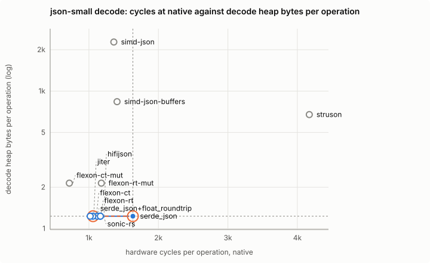

Two-axis frontier: `flexon-rt`, `flexon-ct`. On rule 1's frontier at this workload: `serde_json`, `sonic-rs`, `flexon-rt`, `flexon-rt-mut`, `flexon-ct`, `flexon-ct-mut`.

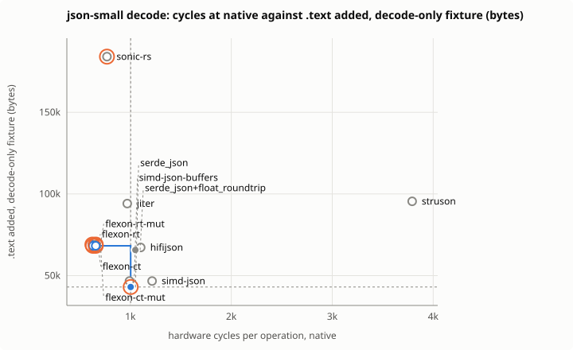

Two-axis frontier: `serde_json`, `flexon-rt`, `flexon-ct`, `flexon-ct-mut`. On rule 1's frontier at this workload: `serde_json`, `sonic-rs`, `flexon-rt`, `flexon-rt-mut`, `flexon-ct`, `flexon-ct-mut`.

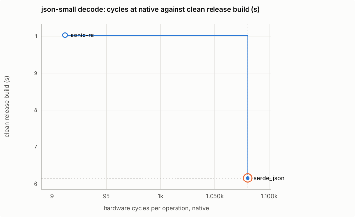

Two-axis frontier: `serde_json`, `flexon-rt`, `flexon-ct`, `flexon-ct-mut`. On rule 1's frontier at this workload: `serde_json`, `sonic-rs`, `flexon-rt`, `flexon-rt-mut`, `flexon-ct`, `flexon-ct-mut`.

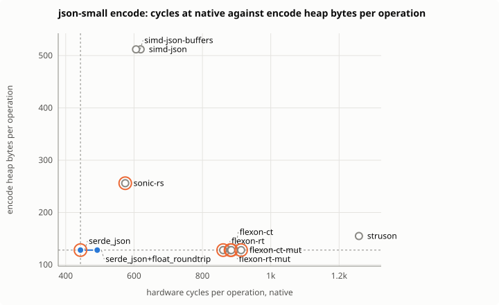

Two-axis frontier: `serde_json`, `serde_json+float_roundtrip`. On rule 1's frontier at this workload: `serde_json`, `sonic-rs`, `flexon-rt`, `flexon-rt-mut`, `flexon-ct`, `flexon-ct-mut`.

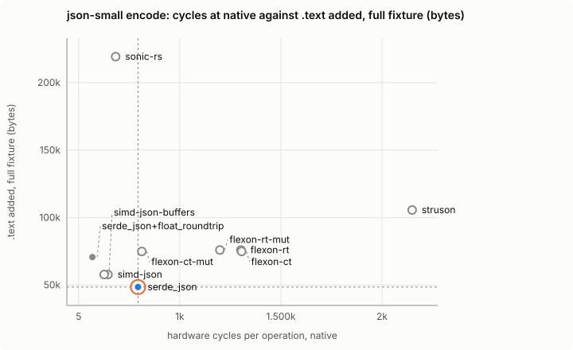

Two-axis frontier: `serde_json`. On rule 1's frontier at this workload: `serde_json`, `sonic-rs`, `flexon-rt`, `flexon-rt-mut`, `flexon-ct`, `flexon-ct-mut`.

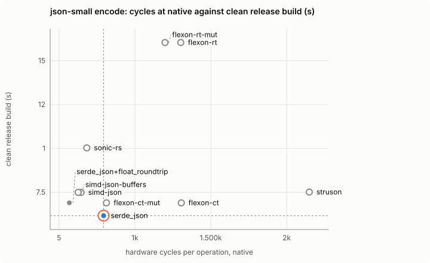

Two-axis frontier: `serde_json`, `serde_json+float_roundtrip`. On rule 1's frontier at this workload: `serde_json`, `sonic-rs`, `flexon-rt`, `flexon-rt-mut`, `flexon-ct`, `flexon-ct-mut`.

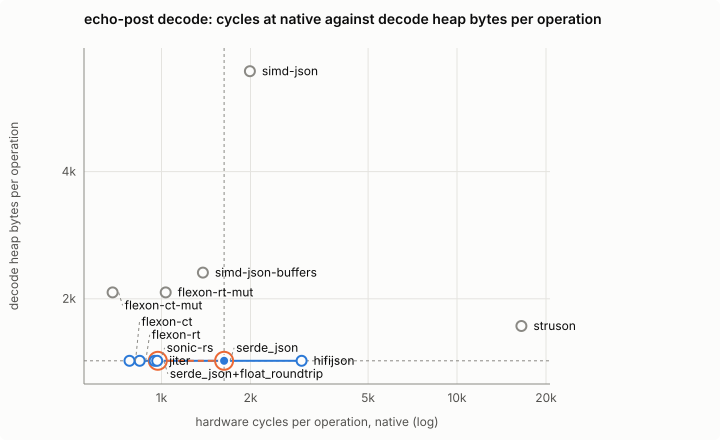

Two-axis frontier: `flexon-rt`, `flexon-ct`. On rule 1's frontier at this workload: `serde_json`, `sonic-rs`, `simd-json`, `simd-json-buffers`, `flexon-rt`, `flexon-rt-mut`, `flexon-ct`, `flexon-ct-mut`, `jiter`.

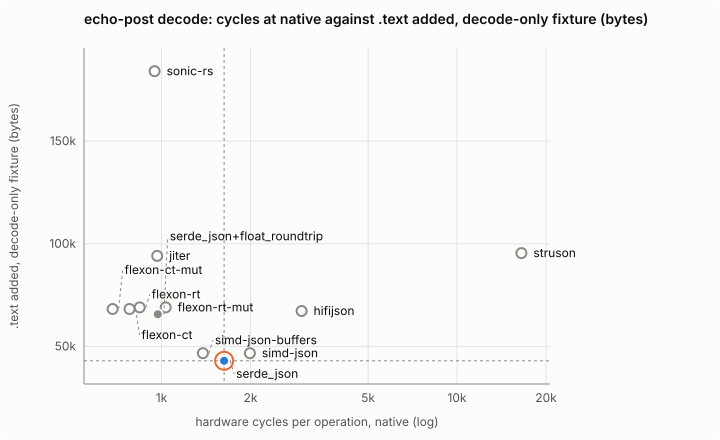

Two-axis frontier: `serde_json`, `flexon-rt`, `flexon-ct`. On rule 1's frontier at this workload: `serde_json`, `sonic-rs`, `simd-json`, `simd-json-buffers`, `flexon-rt`, `flexon-rt-mut`, `flexon-ct`, `flexon-ct-mut`, `jiter`.

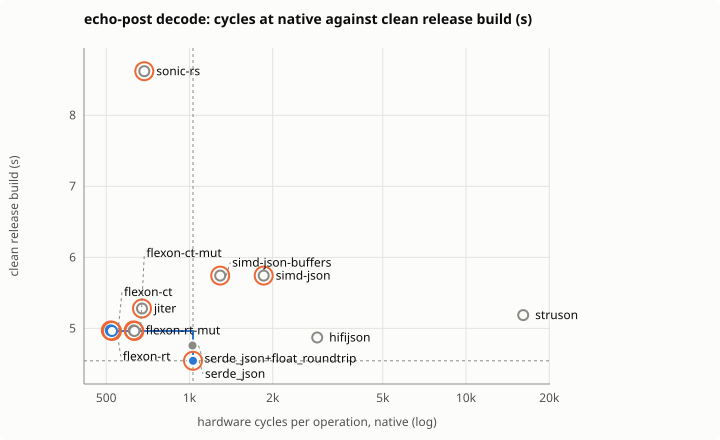

Two-axis frontier: `serde_json`, `flexon-rt`, `flexon-ct`. On rule 1's frontier at this workload: `serde_json`, `sonic-rs`, `simd-json`, `simd-json-buffers`, `flexon-rt`, `flexon-rt-mut`, `flexon-ct`, `flexon-ct-mut`, `jiter`.

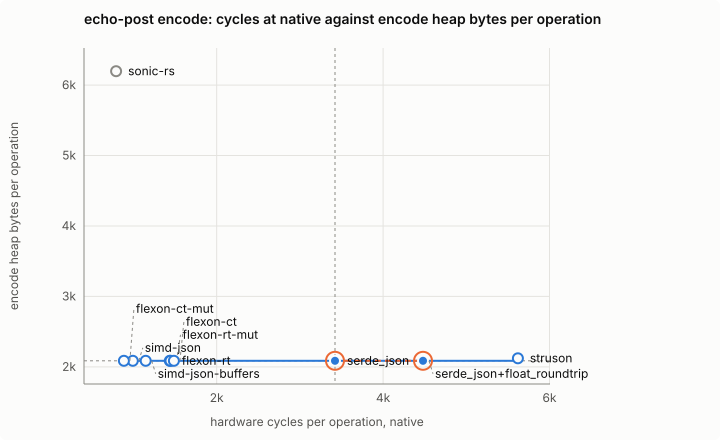

Two-axis frontier: `sonic-rs`, `simd-json`, `simd-json-buffers`. On rule 1's frontier at this workload: `serde_json`, `sonic-rs`, `simd-json`, `simd-json-buffers`, `flexon-rt`, `flexon-rt-mut`, `flexon-ct`, `flexon-ct-mut`.

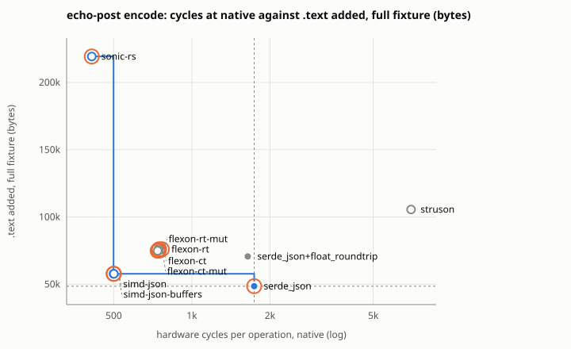

Two-axis frontier: `serde_json`, `sonic-rs`, `simd-json`, `simd-json-buffers`. On rule 1's frontier at this workload: `serde_json`, `sonic-rs`, `simd-json`, `simd-json-buffers`, `flexon-rt`, `flexon-rt-mut`, `flexon-ct`, `flexon-ct-mut`.

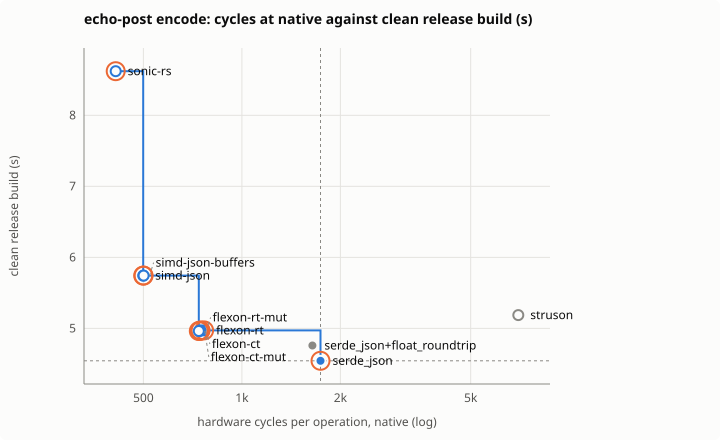

Two-axis frontier: `serde_json`, `sonic-rs`, `simd-json`, `simd-json-buffers`, `flexon-rt`, `flexon-rt-mut`, `flexon-ct`, `flexon-ct-mut`. On rule 1's frontier at this workload: `serde_json`, `sonic-rs`, `simd-json`, `simd-json-buffers`, `flexon-rt`, `flexon-rt-mut`, `flexon-ct`, `flexon-ct-mut`.

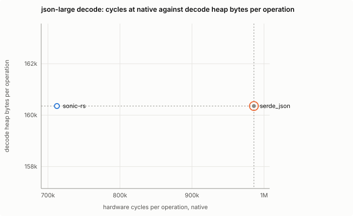

Two-axis frontier: `flexon-rt`, `flexon-ct`. On rule 1's frontier at this workload: `serde_json`, `sonic-rs`, `simd-json`, `simd-json-buffers`, `flexon-rt`, `flexon-rt-mut`, `flexon-ct`, `flexon-ct-mut`.

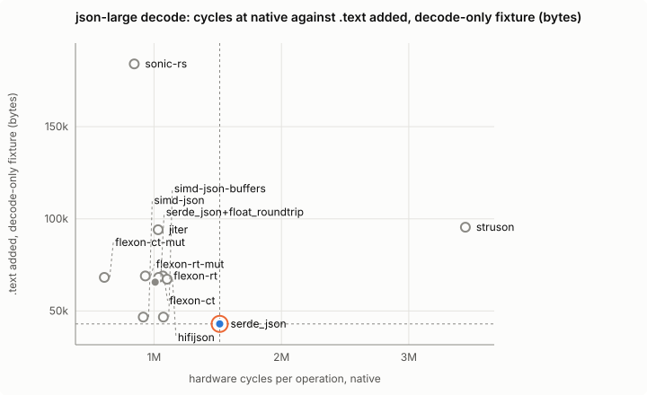

Two-axis frontier: `serde_json`, `simd-json`, `simd-json-buffers`, `flexon-rt-mut`, `flexon-ct`, `flexon-ct-mut`. On rule 1's frontier at this workload: `serde_json`, `sonic-rs`, `simd-json`, `simd-json-buffers`, `flexon-rt`, `flexon-rt-mut`, `flexon-ct`, `flexon-ct-mut`.

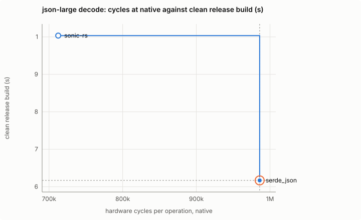

Two-axis frontier: `serde_json`, `flexon-rt-mut`, `flexon-ct`, `flexon-ct-mut`. On rule 1's frontier at this workload: `serde_json`, `sonic-rs`, `simd-json`, `simd-json-buffers`, `flexon-rt`, `flexon-rt-mut`, `flexon-ct`, `flexon-ct-mut`.

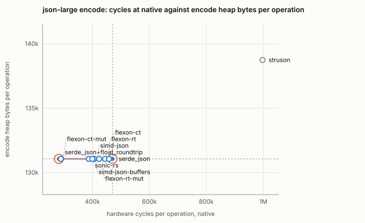

Two-axis frontier: `serde_json`, `serde_json+float_roundtrip`, `sonic-rs`, `flexon-rt`, `flexon-rt-mut`, `flexon-ct`, `flexon-ct-mut`. On rule 1's frontier at this workload: `serde_json`, `sonic-rs`, `simd-json`, `simd-json-buffers`, `flexon-rt`, `flexon-rt-mut`, `flexon-ct`, `flexon-ct-mut`.

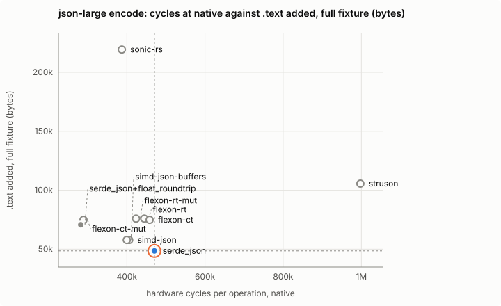

Two-axis frontier: `serde_json`. On rule 1's frontier at this workload: `serde_json`, `sonic-rs`, `simd-json`, `simd-json-buffers`, `flexon-rt`, `flexon-rt-mut`, `flexon-ct`, `flexon-ct-mut`.

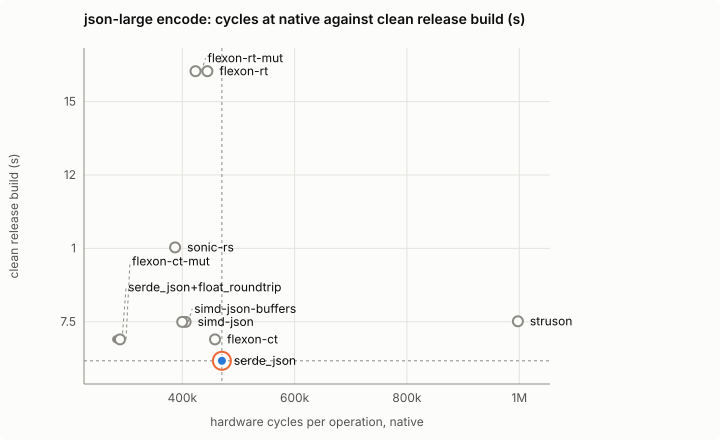

Two-axis frontier: `serde_json`, `serde_json+float_roundtrip`. On rule 1's frontier at this workload: `serde_json`, `sonic-rs`, `simd-json`, `simd-json-buffers`, `flexon-rt`, `flexon-rt-mut`, `flexon-ct`, `flexon-ct-mut`.

### Every other workload: decode cycles against heap

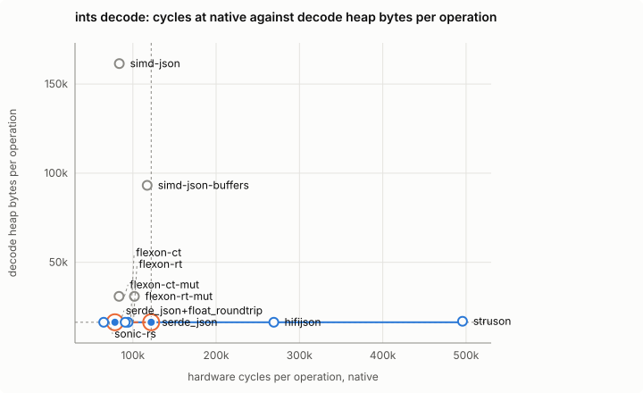

Two-axis frontier: `flexon-rt`, `flexon-ct`. On the *deserves to exist* frontier at this workload: `serde_json`, `sonic-rs`, `flexon-rt`, `flexon-rt-mut`, `flexon-ct`, `flexon-ct-mut`.

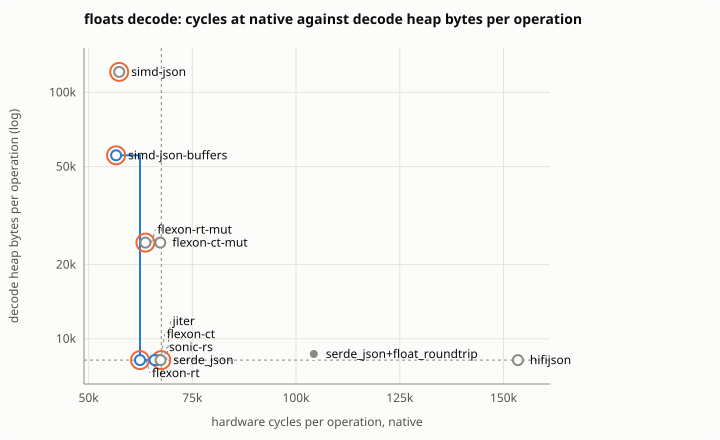

Two-axis frontier: `simd-json-buffers`, `flexon-rt`, `flexon-ct`. On the *deserves to exist* frontier at this workload: `serde_json`, `simd-json`, `simd-json-buffers`, `flexon-rt`, `flexon-rt-mut`.

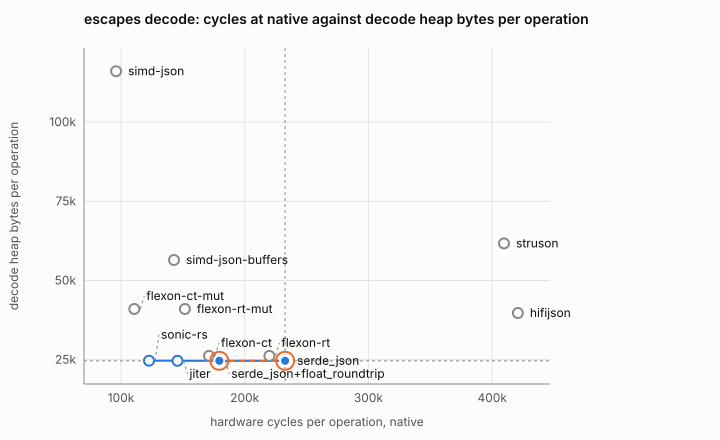

Two-axis frontier: `sonic-rs`, `simd-json-buffers`, `flexon-ct-mut`. On the *deserves to exist* frontier at this workload: `serde_json`, `sonic-rs`, `simd-json`, `simd-json-buffers`, `flexon-rt`, `flexon-rt-mut`, `flexon-ct`, `flexon-ct-mut`, `jiter`.

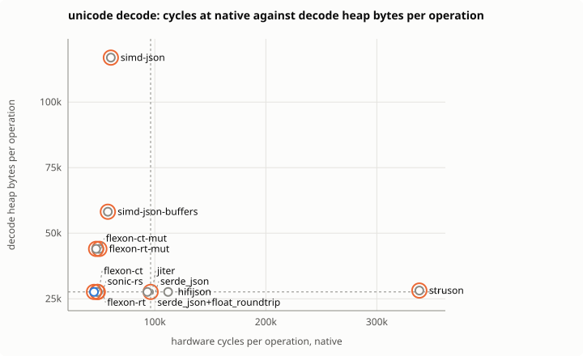

Two-axis frontier: `flexon-ct`. On the *deserves to exist* frontier at this workload: `serde_json`, `sonic-rs`, `simd-json`, `simd-json-buffers`, `flexon-rt`, `flexon-rt-mut`, `flexon-ct`, `flexon-ct-mut`, `struson`.

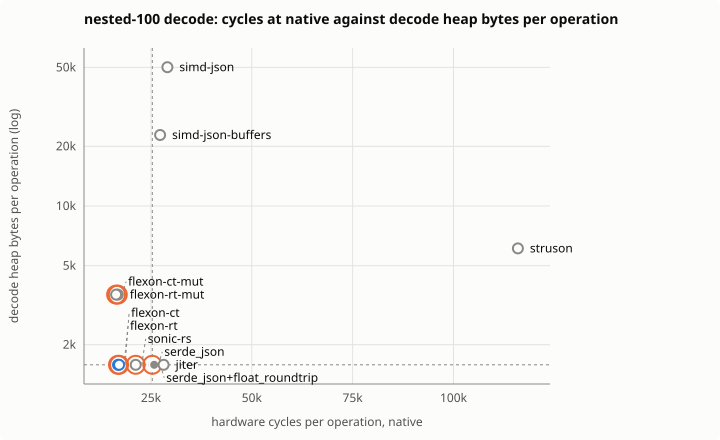

Two-axis frontier: `flexon-rt`, `flexon-ct`. On the *deserves to exist* frontier at this workload: `serde_json`, `sonic-rs`, `flexon-rt`, `flexon-rt-mut`, `flexon-ct`, `flexon-ct-mut`.

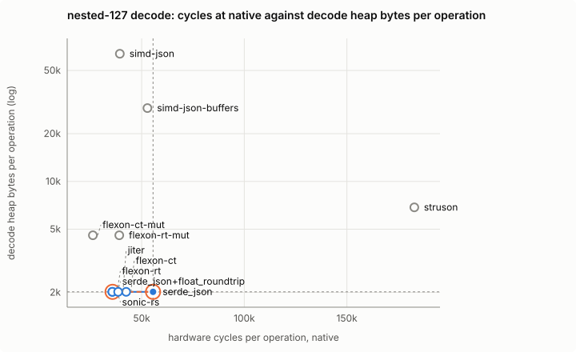

Two-axis frontier: `flexon-rt`, `flexon-ct`. On the *deserves to exist* frontier at this workload: `serde_json`, `sonic-rs`, `flexon-rt`, `flexon-rt-mut`, `flexon-ct`, `flexon-ct-mut`.

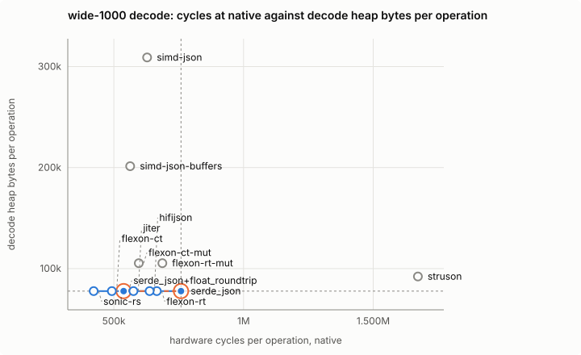

Two-axis frontier: `sonic-rs`, `flexon-rt`, `flexon-ct`. On the *deserves to exist* frontier at this workload: `serde_json`, `sonic-rs`, `flexon-rt`, `flexon-rt-mut`, `flexon-ct`, `flexon-ct-mut`.

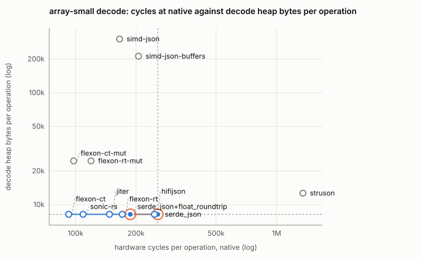

Two-axis frontier: `sonic-rs`, `flexon-rt`, `flexon-ct`. On the *deserves to exist* frontier at this workload: `serde_json`, `sonic-rs`, `flexon-rt`, `flexon-rt-mut`, `flexon-ct`, `flexon-ct-mut`.

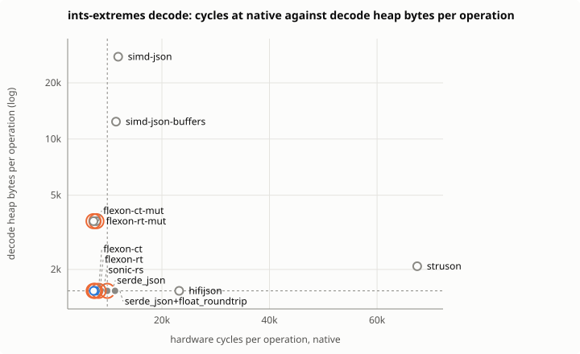

Two-axis frontier: `flexon-rt`, `flexon-ct`. On the *deserves to exist* frontier at this workload: `serde_json`, `sonic-rs`, `flexon-rt`, `flexon-rt-mut`, `flexon-ct`, `flexon-ct-mut`.

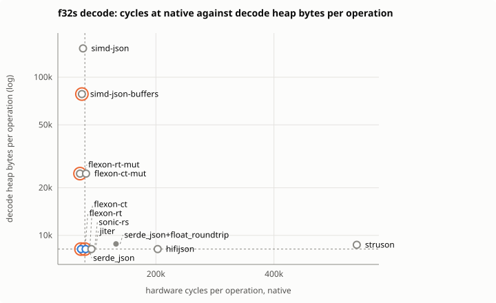

Two-axis frontier: `flexon-rt`, `flexon-ct`. On the *deserves to exist* frontier at this workload: `serde_json`, `simd-json-buffers`, `flexon-rt`, `flexon-rt-mut`.

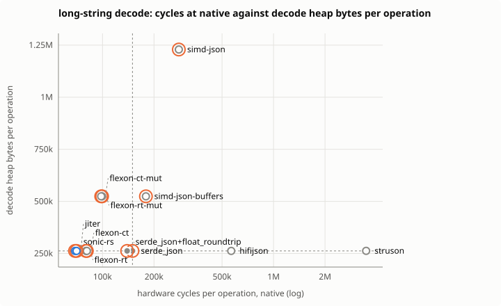

Two-axis frontier: `sonic-rs`, `jiter`. On the *deserves to exist* frontier at this workload: `serde_json`, `serde_json+float_roundtrip`, `sonic-rs`, `simd-json`, `simd-json-buffers`, `flexon-rt`, `flexon-rt-mut`, `flexon-ct`, `flexon-ct-mut`, `jiter`.

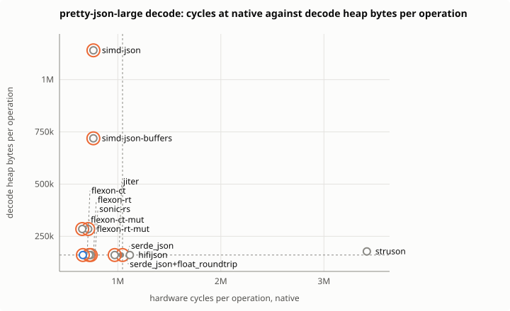

Two-axis frontier: `flexon-ct`. On the *deserves to exist* frontier at this workload: `serde_json`, `sonic-rs`, `simd-json`, `simd-json-buffers`, `flexon-rt`, `flexon-rt-mut`, `flexon-ct`, `flexon-ct-mut`, `jiter`.

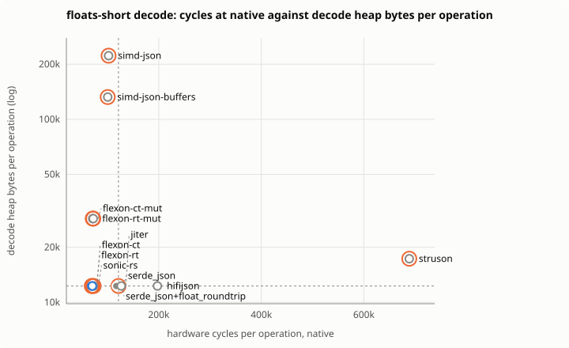

Two-axis frontier: `flexon-rt`, `flexon-ct`. On the *deserves to exist* frontier at this workload: `serde_json`, `sonic-rs`, `simd-json`, `simd-json-buffers`, `flexon-rt`, `flexon-rt-mut`, `flexon-ct`, `flexon-ct-mut`, `struson`.

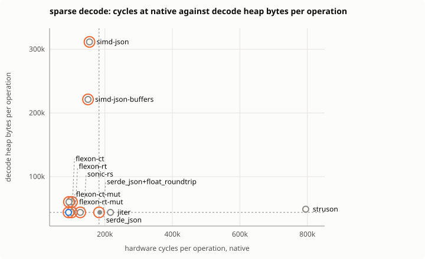

Two-axis frontier: `flexon-ct`. On the *deserves to exist* frontier at this workload: `serde_json`, `sonic-rs`, `simd-json`, `simd-json-buffers`, `flexon-rt`, `flexon-rt-mut`, `flexon-ct`, `flexon-ct-mut`.

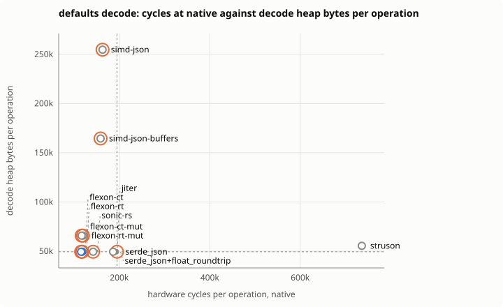

Two-axis frontier: `flexon-rt`, `flexon-ct`. On the *deserves to exist* frontier at this workload: `serde_json`, `sonic-rs`, `simd-json`, `simd-json-buffers`, `flexon-rt`, `flexon-rt-mut`, `flexon-ct`, `flexon-ct-mut`.

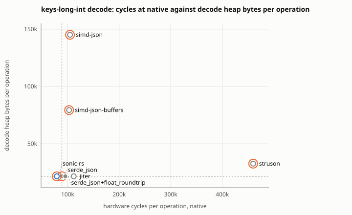

Two-axis frontier: `sonic-rs`. On the *deserves to exist* frontier at this workload: `serde_json`, `sonic-rs`, `simd-json`, `simd-json-buffers`, `struson`.

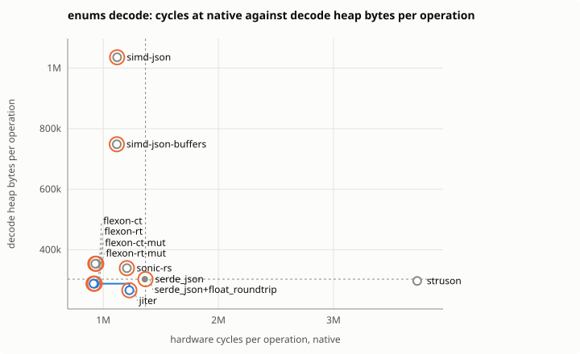

Two-axis frontier: `flexon-rt`, `flexon-ct`, `jiter`. On the *deserves to exist* frontier at this workload: `serde_json`, `sonic-rs`, `simd-json`, `simd-json-buffers`, `flexon-rt`, `flexon-rt-mut`, `flexon-ct`, `flexon-ct-mut`, `jiter`.

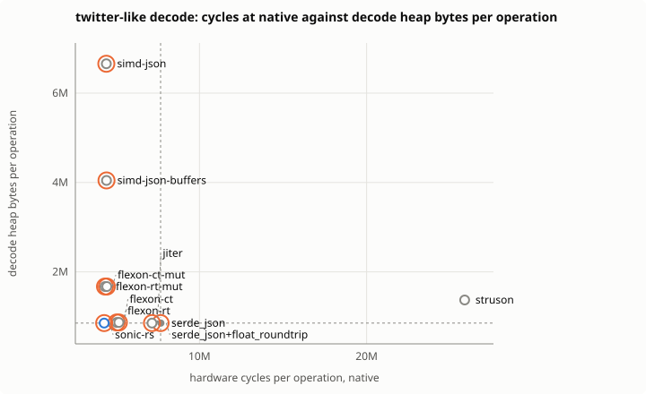

Two-axis frontier: `sonic-rs`. On the *deserves to exist* frontier at this workload: `serde_json`, `sonic-rs`, `simd-json`, `simd-json-buffers`, `flexon-rt`, `flexon-rt-mut`, `flexon-ct`, `flexon-ct-mut`, `jiter`.

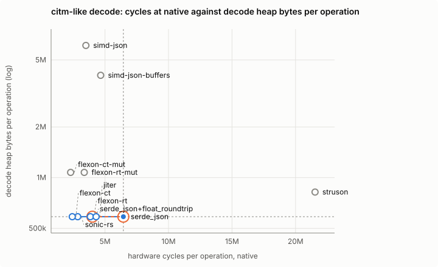

Two-axis frontier: `flexon-rt`, `flexon-ct`. On the *deserves to exist* frontier at this workload: `serde_json`, `sonic-rs`, `simd-json`, `simd-json-buffers`, `flexon-rt`, `flexon-rt-mut`, `flexon-ct`, `flexon-ct-mut`.

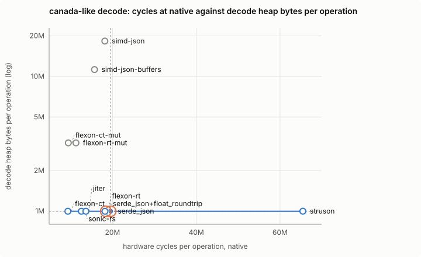

Two-axis frontier: `flexon-ct`. On the *deserves to exist* frontier at this workload: `serde_json`, `simd-json`, `simd-json-buffers`, `flexon-rt`, `flexon-rt-mut`, `flexon-ct`, `flexon-ct-mut`.

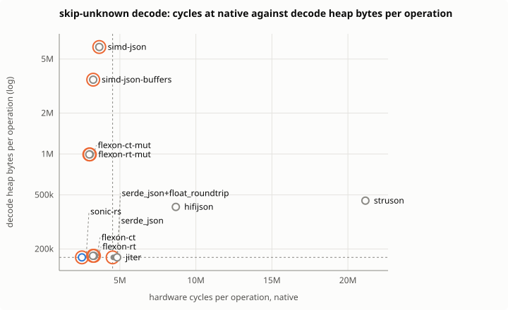

Two-axis frontier: `sonic-rs`. On the *deserves to exist* frontier at this workload: `serde_json`, `sonic-rs`, `simd-json`, `simd-json-buffers`, `flexon-rt`, `flexon-rt-mut`, `flexon-ct`, `flexon-ct-mut`.

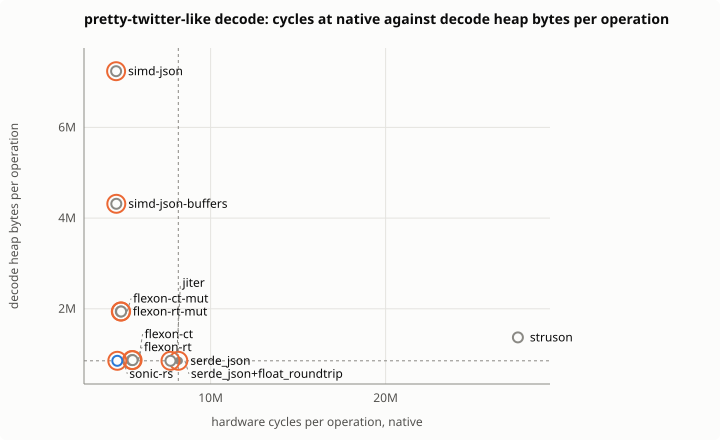

Two-axis frontier: `sonic-rs`. On the *deserves to exist* frontier at this workload: `serde_json`, `sonic-rs`, `simd-json`, `simd-json-buffers`, `flexon-rt`, `flexon-rt-mut`, `flexon-ct`, `flexon-ct-mut`, `jiter`.

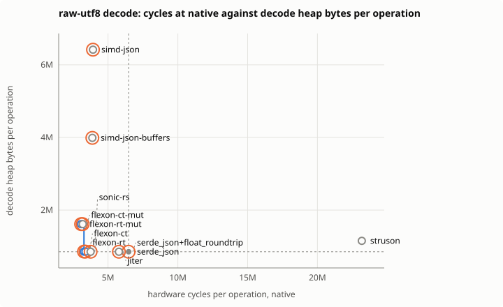

Two-axis frontier: `flexon-rt`, `flexon-rt-mut`, `flexon-ct`. On the *deserves to exist* frontier at this workload: `serde_json`, `sonic-rs`, `simd-json`, `simd-json-buffers`, `flexon-rt`, `flexon-rt-mut`, `flexon-ct`, `flexon-ct-mut`, `jiter`.

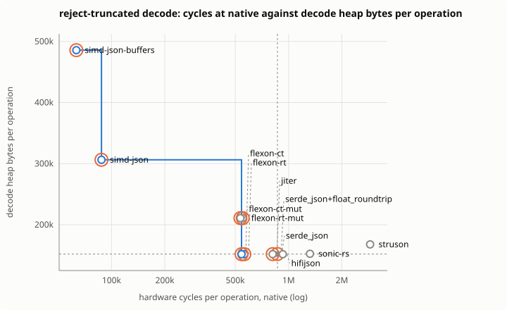

Two-axis frontier: `simd-json`, `simd-json-buffers`, `flexon-rt`, `flexon-ct`. On the *deserves to exist* frontier at this workload: `serde_json`, `simd-json`, `simd-json-buffers`, `flexon-rt`, `flexon-rt-mut`, `flexon-ct`, `flexon-ct-mut`, `jiter`.

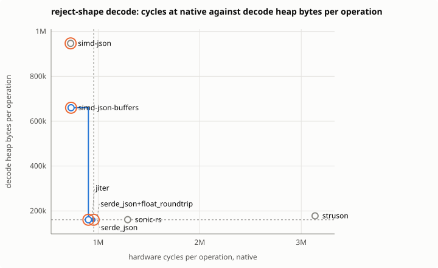

Two-axis frontier: `serde_json+float_roundtrip`, `simd-json-buffers`, `jiter`. On the *deserves to exist* frontier at this workload: `serde_json`, `simd-json`, `simd-json-buffers`, `jiter`.

## Size sweep: decode

| Workload | Point | serde_json | A/A | `serde_json+float_roundtrip` | `sonic-rs` | `simd-json` | `simd-json-buffers` | `flexon-rt` | `flexon-rt-mut` | `flexon-ct` | `flexon-ct-mut` | `jiter` | `hifijson` | `struson` |
| --- | --- | --- | --- | --- | --- | --- | --- | --- | --- | --- | --- | --- | --- | --- |
| sweep-64b | native (cycles) | 781 | 1.00× (±5.0 %) | 1.02× | 0.75× | 1.29× | 1.03× | 0.64× | 0.67× | 0.68× | 0.69× | 1.19× | 1.32× | 3.81× |
| sweep-64b | v3 (est. cycles) | 2867 | exact | 1.01× | 0.81× | 1.45× | 0.91× | 0.72× | 0.75× | 0.73× | 0.77× | 0.90× | 1.15× | 4.01× |
| sweep-256b | native (cycles) | 1862 | 1.01× (±5.0 %) | 1.00× | 0.67× | 1.12× | 0.87× | 0.60× | 0.60× | 0.58× | 0.60× | 1.05× | 1.29× | 4.40× |
| sweep-256b | v3 (est. cycles) | 7164 | exact | 1.01× | 0.74× | 1.18× | 0.84× | 0.67× | 0.68× | 0.67× | 0.67× | 0.87× | 1.26× | 4.29× |
| sweep-1kib | native (cycles) | 12.1 k | 1.01× (±5.0 %) | 0.99× | 0.67× | 0.84× | 0.75× | 0.61× | 0.61× | 0.59× | 0.58× | 0.98× | 1.10× | 3.74× |
| sweep-1kib | v3 (est. cycles) | 42.9 k | exact | 1.01× | 0.75× | 0.97× | 0.88× | 0.70× | 0.69× | 0.68× | 0.68× | 0.90× | 1.17× | 3.56× |
| sweep-4kib | native (cycles) | 53.8 k | 0.99× (±5.0 %) | 0.98× | 0.69× | 0.79× | 0.77× | 0.64× | 0.64× | 0.62× | 0.62× | 0.96× | 1.06× | 3.42× |
| sweep-4kib | v3 (est. cycles) | 180.2 k | exact | 1.00× | 0.76× | 0.96× | 0.93× | 0.71× | 0.87× | 0.69× | 0.85× | 0.90× | 1.17× | 3.40× |
| sweep-16kib | native (cycles) | 217.9 k | 1.00× (±5.0 %) | 0.99× | 0.72× | 0.80× | 0.78× | 0.67× | 0.65× | 0.64× | 0.63× | 0.95× | 1.09× | 3.49× |
| sweep-16kib | v3 (est. cycles) | 880.4 k | exact | 1.01× | 0.80× | 0.84× | 0.82× | 0.76× | 0.77× | 0.74× | 0.75× | 0.91× | 1.14× | 3.01× |
| sweep-64kib | native (cycles) | 880.6 k | 1.00× (±5.0 %) | 0.98× | 0.71× | 0.78× | 0.77× | 0.66× | 0.65× | 0.63× | 0.62× | 0.96× | 1.09× | 3.40× |
| sweep-64kib | v3 (est. cycles) | 3.58 M | exact | 1.01× | 0.80× | 0.83× | 0.82× | 0.76× | 0.77× | 0.74× | 0.75× | 0.92× | 1.14× | 2.98× |
| sweep-256kib | native (cycles) | 3.58 M | 1.00× (±5.1 %) | 0.99× | 0.71× | 0.77× | 0.77× | 0.66× | 0.64× | 0.63× | 0.62× | 0.94× | 1.09× | 3.34× |
| sweep-256kib | v3 (est. cycles) | 14.40 M | exact | 1.01× | 0.80× | 0.82× | 0.81× | 0.76× | 0.77× | 0.74× | 0.76× | 0.91× | 1.14× | 2.97× |
| sweep-1mib | native (cycles) | 14.29 M | 1.00× (±5.0 %) | 0.98× | 0.72× | 0.78× | 0.77× | 0.66× | 0.65× | 0.64× | 0.63× | 0.94× | 1.10× | 3.40× |
| sweep-1mib | v3 (est. cycles) | 57.67 M | exact | 1.01× | 0.80× | 0.89× | 0.88× | 0.76× | 0.76× | 0.74× | 0.74× | 0.91× | 1.14× | 2.97× |

## Size sweep: encode

| Workload | Point | serde_json | A/A | `serde_json+float_roundtrip` | `sonic-rs` | `simd-json` | `simd-json-buffers` | `flexon-rt` | `flexon-rt-mut` | `flexon-ct` | `flexon-ct-mut` | `struson` |
| --- | --- | --- | --- | --- | --- | --- | --- | --- | --- | --- | --- | --- |
| sweep-64b | native (cycles) | 297 | 1.01× (±5.0 %) | 0.99× | 1.16× | 1.08× | 1.06× | 2.10× | 2.10× | 1.93× | 1.94× | 3.11× |
| sweep-64b | v3 (est. cycles) | 1232 | exact | 1.00× | 1.03× | 1.08× | 1.08× | 1.64× | 1.64× | 1.64× | 1.64× | 3.13× |
| sweep-256b | native (cycles) | 876 | 1.05× (±7.7 %) | 1.00× | 0.98× | 1.03× | 1.02× | 1.36× | 1.35× | 1.36× | 1.38× | 3.15× |
| sweep-256b | v3 (est. cycles) | 4108 | exact | 1.00× | 0.81× | 0.87× | 0.87× | 1.03× | 1.03× | 1.03× | 1.03× | 2.55× |
| sweep-1kib | native (cycles) | 4100 | 1.01× (±5.0 %) | 1.02× | 1.11× | 1.32× | 1.33× | 1.05× | 1.06× | 1.08× | 1.07× | 2.56× |
| sweep-1kib | v3 (est. cycles) | 17.4 k | exact | 1.00× | 0.89× | 1.21× | 1.21× | 0.95× | 0.95× | 0.95× | 0.95× | 2.37× |
| sweep-4kib | native (cycles) | 17.2 k | 0.98× (±5.0 %) | 0.97× | 0.98× | 1.29× | 1.28× | 0.95× | 0.94× | 0.96× | 0.96× | 2.37× |
| sweep-4kib | v3 (est. cycles) | 67.4 k | exact | 1.00× | 0.89× | 1.25× | 1.25× | 0.92× | 0.92× | 0.92× | 0.92× | 2.34× |
| sweep-16kib | native (cycles) | 67.1 k | 1.01× (±5.0 %) | 1.02× | 1.03× | 1.35× | 1.38× | 0.99× | 0.99× | 1.00× | 1.00× | 2.39× |
| sweep-16kib | v3 (est. cycles) | 271.6 k | exact | 1.00× | 0.91× | 1.28× | 1.28× | 0.93× | 0.93× | 0.93× | 0.93× | 2.32× |
| sweep-64kib | native (cycles) | 272.9 k | 0.99× (±5.0 %) | 0.99× | 1.01× | 1.34× | 1.35× | 0.95× | 0.96× | 0.96× | 0.97× | 2.37× |
| sweep-64kib | v3 (est. cycles) | 1.08 M | exact | 1.00× | 0.92× | 1.30× | 1.30× | 0.93× | 0.93× | 0.93× | 0.93× | 2.37× |
| sweep-256kib | native (cycles) | 1.07 M | 1.00× (±5.0 %) | 1.01× | 1.03× | 1.38× | 1.40× | 0.96× | 0.96× | 0.98× | 0.98× | 2.43× |
| sweep-256kib | v3 (est. cycles) | 4.29 M | exact | 1.00× | 0.92× | 1.30× | 1.30× | 0.94× | 0.94× | 0.94× | 0.94× | 2.37× |
| sweep-1mib | native (cycles) | 4.27 M | 1.00× (±5.0 %) | 1.00× | 1.03× | 1.38× | 1.40× | 0.97× | 0.96× | 1.00× | 0.98× | 2.46× |
| sweep-1mib | v3 (est. cycles) | 17.10 M | exact | 1.00× | 0.92× | 1.30× | 1.30× | 0.94× | 0.94× | 0.94× | 0.94× | 2.49× |

## One variable at a time, and real-world shapes: decode

Where serde_json rejects a workload (`nested-129`: its depth limit is 128), a backend that accepts it is shown absolute.

| Workload | Point | serde_json | A/A | `serde_json+float_roundtrip` | `sonic-rs` | `simd-json` | `simd-json-buffers` | `flexon-rt` | `flexon-rt-mut` | `flexon-ct` | `flexon-ct-mut` | `jiter` | `hifijson` | `struson` |
| --- | --- | --- | --- | --- | --- | --- | --- | --- | --- | --- | --- | --- | --- | --- |
| ints | native (cycles) | 65.5 k | 1.00× (±5.0 %) | 1.16× | 0.86× | 1.29× | 1.23× | 0.80× | 0.81× | 0.78× | 0.77× | rejected | 2.47× | 7.54× |
| ints | v3 (est. cycles) | 352.7 k | exact | 1.14× | 0.88× | 1.20× | 1.18× | 0.85× | 0.89× | 0.81× | 0.84× | rejected | 2.33× | 4.96× |
| floats | native (cycles) | 67.5 k | 1.01× (±5.0 %) | 1.54× | 0.98× | 0.85× | 0.84× | 0.92× | 0.94× | 0.98× | 1.00× | 1.00× | 2.27× | rejected |
| floats | v3 (est. cycles) | 358.1 k | exact | 1.39× | 1.03× | 0.90× | 0.89× | 0.96× | 1.01× | 0.78× | 0.83× | 1.04× | 2.25× | rejected |
| escapes | native (cycles) | 163.7 k | 1.02× (±5.0 %) | 1.00× | 0.59× | 0.53× | 0.52× | 0.87× | 0.57× | 0.85× | 0.55× | 0.91× | 1.70× | 2.43× |
| escapes | v3 (est. cycles) | 519.5 k | exact | 0.98× | 0.69× | 0.72× | 0.70× | 0.89× | 0.81× | 0.87× | 0.79× | 0.95× | 1.68× | 2.68× |
| unicode | native (cycles) | 96.2 k | 1.01× (±5.0 %) | 0.97× | 0.51× | 0.63× | 0.60× | 0.50× | 0.52× | 0.47× | 0.49× | 0.97× | 1.16× | 3.52× |
| unicode | v3 (est. cycles) | 391.1 k | exact | 1.01× | 0.56× | 0.79× | 0.78× | 0.54× | 0.66× | 0.52× | 0.64× | 0.98× | 1.32× | 3.50× |
| nested-100 | native (cycles) | 25.3 k | 1.01× (±12.5 %) | 1.02× | 0.84× | 1.15× | 1.08× | 0.66× | 0.66× | 0.67× | 0.65× | 1.11× | rejected | 4.58× |
| nested-100 | v3 (est. cycles) | 99.0 k | exact | 1.02× | 0.81× | 1.18× | 1.13× | 0.67× | 0.85× | 0.66× | 0.85× | 0.95× | rejected | 4.20× |
| nested-127 | native (cycles) | 32.8 k | 1.00× (±5.0 %) | 1.00× | 0.85× | 1.09× | 1.07× | 0.69× | 0.70× | 0.68× | 0.68× | 1.11× | rejected | 4.43× |
| nested-127 | v3 (est. cycles) | 126.1 k | exact | 1.02× | 0.82× | 1.18× | 1.14× | 0.68× | 0.87× | 0.67× | 0.86× | 0.95× | rejected | 4.35× |
| nested-129 | native (cycles) | rejected | — (±—) | rejected | 28.5 k (abs.) | 36.1 k (abs.) | 34.9 k (abs.) | 21.6 k (abs.) | 22.9 k (abs.) | 21.9 k (abs.) | 22.6 k (abs.) | 36.6 k (abs.) | rejected | rejected |
| nested-129 | v3 (est. cycles) | rejected | exact | rejected | 105.5 k (abs.) | 149.8 k (abs.) | 144.9 k (abs.) | 87.1 k (abs.) | 110.6 k (abs.) | 86.8 k (abs.) | 109.8 k (abs.) | 122.6 k (abs.) | rejected | rejected |
| nested-10000 | native (cycles) | rejected | — (±—) | rejected | rejected | rejected | rejected | 1.80 M (abs.) | 1.83 M (abs.) | 1.86 M (abs.) | 1.80 M (abs.) | rejected | rejected | rejected |
| nested-10000 | v3 (est. cycles) | rejected | exact | rejected | rejected | rejected | rejected | 7.36 M (abs.) | 9.41 M (abs.) | 7.33 M (abs.) | 9.34 M (abs.) | rejected | rejected | rejected |
| wide-1000 | native (cycles) | 460.0 k | 1.01× (±5.0 %) | 1.04× | 0.90× | 1.07× | 1.02× | 0.87× | 0.92× | 0.86× | 0.91× | 1.07× | 1.24× | 2.55× |
| wide-1000 | v3 (est. cycles) | 1.96 M | exact | 1.02× | 0.90× | 1.10× | 1.09× | 0.90× | 1.01× | 0.90× | 1.01× | 0.96× | 1.28× | 2.24× |
| array-small | native (cycles) | 156.2 k | 1.00× (±26.7 %) | 1.04× | 0.67× | 1.02× | 1.01× | 0.58× | 0.57× | 0.57× | 0.57× | 0.99× | 1.40× | 5.90× |
| array-small | v3 (est. cycles) | 681.5 k | exact | 1.06× | 0.86× | 1.03× | 1.01× | 0.75× | 0.75× | 0.72× | 0.75× | 0.96× | 1.36× | 4.99× |
| ints-extremes | native (cycles) | 9844 | 1.00× (±5.0 %) | 1.15× | 0.83× | 1.21× | 1.16× | 0.77× | 0.79× | 0.74× | 0.74× | rejected | 2.36× | 6.85× |
| ints-extremes | v3 (est. cycles) | 49.4 k | exact | 1.14× | 0.86× | 1.14× | 1.06× | 0.83× | 0.84× | 0.79× | 0.80× | rejected | 2.32× | 4.81× |
| f32s | native (cycles) | 79.8 k | 1.00× (±5.0 %) | 1.66× | 1.12× | 0.96× | 0.94× | 0.92× | 0.90× | 1.02× | 1.02× | 1.14× | 2.55× | 6.77× |
| f32s | v3 (est. cycles) | 430.3 k | exact | 1.49× | 1.15× | 0.98× | 0.97× | 0.92× | 1.02× | 0.80× | 0.90× | 1.24× | 2.45× | 4.46× |
| long-string | native (cycles) | 149.8 k | 1.00× (±5.0 %) | 0.93× | 0.46× | 1.87× | 1.20× | 0.53× | 0.66× | 0.54× | 0.66× | 0.47× | 3.78× | 23.22× |
| long-string | v3 (est. cycles) | 984.5 k | exact | 1.00× | 0.64× | 1.63× | 1.62× | 0.62× | 0.93× | 0.62× | 0.93× | 0.53× | 3.13× | 14.38× |
| pretty-json-large | native (cycles) | 1.05 M | 1.00× (±5.0 %) | 0.99× | 0.71× | 0.73× | 0.73× | 0.69× | 0.68× | 0.63× | 0.63× | 0.93× | 1.07× | 3.26× |
| pretty-json-large | v3 (est. cycles) | 4.45 M | exact | 1.01× | 0.80× | 0.77× | 0.77× | 0.72× | 0.74× | 0.69× | 0.72× | 0.91× | 1.14× | 2.84× |
| floats-short | native (cycles) | 121.4 k | 1.01× (±5.0 %) | 0.96× | 0.60× | 0.84× | 0.83× | 0.57× | 0.59× | 0.58× | 0.60× | 1.04× | 1.63× | 5.67× |
| floats-short | v3 (est. cycles) | 543.6 k | exact | 1.05× | 0.77× | 0.91× | 0.85× | 0.74× | 0.75× | 0.69× | 0.71× | 1.06× | 1.68× | 4.55× |
| sparse | native (cycles) | 182.8 k | 1.01× (±5.0 %) | 1.01× | 0.70× | 0.84× | 0.82× | 0.56× | 0.56× | 0.51× | 0.51× | 1.18× | rejected | 4.35× |
| sparse | v3 (est. cycles) | 614.9 k | exact | 1.00× | 0.80× | 1.00× | 0.95× | 0.70× | 0.80× | 0.65× | 0.76× | 0.91× | rejected | 4.54× |
| defaults | native (cycles) | 194.9 k | 0.99× (±5.0 %) | 0.99× | 0.73× | 0.84× | 0.81× | 0.61× | 0.61× | 0.59× | 0.60× | 0.96× | rejected | 3.78× |
| defaults | v3 (est. cycles) | 788.8 k | exact | 1.01× | 0.77× | 0.85× | 0.82× | 0.70× | 0.69× | 0.69× | 0.69× | 0.89× | rejected | 3.33× |
| keys-long-int | native (cycles) | 88.9 k | 1.00× (±5.0 %) | 1.07× | 0.89× | 1.18× | 1.16× | rejected | rejected | rejected | rejected | 1.26× | rejected | 5.18× |
| keys-long-int | v3 (est. cycles) | 422.0 k | exact | 1.07× | 0.91× | 1.24× | 1.22× | rejected | rejected | rejected | rejected | 1.00× | rejected | 4.16× |
| enums | native (cycles) | 1.37 M | 1.00× (±5.0 %) | 1.00× | 0.88× | 0.82× | 0.82× | 0.68× | 0.69× | 0.67× | 0.68× | 0.90× | rejected | 2.73× |
| enums | v3 (est. cycles) | 5.01 M | exact | 1.00× | 0.92× | 0.69× | 0.67× | 0.69× | 0.70× | 0.69× | 0.69× | 0.74× | rejected | 2.43× |
| twitter-like | native (cycles) | 7.68 M | 1.01× (±5.0 %) | 1.00× | 0.56× | 0.58× | 0.58× | 0.66× | 0.57× | 0.67× | 0.58× | 0.93× | rejected | 3.37× |
| twitter-like | v3 (est. cycles) | 25.54 M | exact | 1.01× | 0.65× | 0.73× | 0.71× | 0.79× | 0.70× | 0.79× | 0.71× | 0.87× | rejected | 3.47× |
| citm-like | native (cycles) | 3.90 M | 0.99× (±5.0 %) | 1.02× | 0.71× | 0.84× | 0.83× | 0.56× | 0.57× | 0.54× | 0.56× | 1.10× | rejected | 4.88× |
| citm-like | v3 (est. cycles) | 15.56 M | exact | 1.03× | 0.75× | 0.91× | 0.89× | 0.62× | 0.64× | 0.60× | 0.63× | 0.88× | rejected | 4.43× |
| canada-like | native (cycles) | 12.62 M | 1.00× (±5.0 %) | 1.22× | 0.96× | 0.86× | 0.85× | 0.84× | 0.86× | 0.74× | 0.74× | 1.07× | rejected | 5.19× |
| canada-like | v3 (est. cycles) | 53.44 M | exact | 1.19× | 1.03× | 1.01× | 0.99× | 0.90× | 0.91× | 0.70× | 0.71× | 1.12× | rejected | 4.24× |
| skip-unknown | native (cycles) | 4.52 M | 1.00× (±5.0 %) | 1.01× | 0.55× | 0.81× | 0.72× | 0.73× | 0.67× | 0.71× | 0.66× | 1.07× | 1.92× | 4.68× |
| skip-unknown | v3 (est. cycles) | 16.44 M | exact | 1.00× | 0.59× | 0.81× | 0.81× | 0.69× | 0.69× | 0.69× | 0.70× | 0.91× | 1.69× | 4.63× |
| pretty-twitter-like | native (cycles) | 8.15 M | 1.01× (±5.0 %) | 1.00× | 0.57× | 0.56× | 0.57× | 0.68× | 0.60× | 0.68× | 0.60× | 0.95× | rejected | 3.38× |
| pretty-twitter-like | v3 (est. cycles) | 28.35 M | exact | 1.01× | 0.67× | 0.62× | 0.61× | 0.76× | 0.66× | 0.75× | 0.65× | 0.86× | rejected | 3.34× |
| raw-utf8 | native (cycles) | 6.47 M | 1.00× (±5.0 %) | 1.00× | 0.58× | 0.61× | 0.60× | 0.51× | 0.47× | 0.52× | 0.49× | 0.89× | rejected | 3.58× |
| raw-utf8 | v3 (est. cycles) | 21.81 M | exact | 1.01× | 0.67× | 0.78× | 0.76× | 0.64× | 0.63× | 0.64× | 0.63× | 0.82× | rejected | 3.72× |
| reject-truncated | native (cycles) | 865.4 k | 0.99× (±5.0 %) | 0.99× | 1.53× | 0.10× | 0.07× | 0.65× | 0.64× | 0.63× | 0.62× | 0.94× | 1.07× | 3.34× |
| reject-truncated | v3 (est. cycles) | 3.48 M | exact | 1.01× | 1.11× | 0.12× | 0.11× | 0.75× | 0.76× | 0.73× | 0.74× | 0.90× | 1.11× | 2.90× |
| reject-shape | native (cycles) | 955.9 k | 1.00× (±5.0 %) | 1.00× | 1.35× | 0.76× | 0.77× | wrong | wrong | wrong | wrong | 0.95× | wrong | 3.28× |
| reject-shape | v3 (est. cycles) | 3.89 M | exact | 1.01× | 1.04× | 0.81× | 0.81× | wrong | wrong | wrong | wrong | 0.91× | wrong | 2.88× |

Cells without a figure, and why (the backend's own answer in the result check):

- `flexon-ct-mut` keys-long-int decode: rejected — Syntax: invalid literal
- `flexon-ct-mut` reject-shape decode: wrong — answered 400, expected 422: Syntax: invalid literal
- `flexon-ct` keys-long-int decode: rejected — Syntax: invalid literal
- `flexon-ct` reject-shape decode: wrong — answered 400, expected 422: Syntax: invalid literal
- `flexon-rt-mut` keys-long-int decode: rejected — Syntax: invalid literal
- `flexon-rt-mut` reject-shape decode: wrong — answered 400, expected 422: Syntax: invalid literal
- `flexon-rt` keys-long-int decode: rejected — Syntax: invalid literal
- `flexon-rt` reject-shape decode: wrong — answered 400, expected 422: Syntax: invalid literal
- `hifijson` canada-like decode: rejected — Data: Custom("invalid type: floating point `-135.48734783145244`, expected a tuple of size 2")
- `hifijson` citm-like decode: rejected — Data: Custom("invalid type: string \"/images/UE0AAAAACEKo3QAAAAVDSVRN\", expected option")
- `hifijson` defaults decode: rejected — Data: Custom("invalid type: integer `0`, expected option")
- `hifijson` enums decode: rejected — Data: Custom("invalid type: string \"stop\", expected enum Command")
- `hifijson` keys-long-int decode: rejected — Syntax: Parse(Num(ExpectedDigit))
- `hifijson` nested-100 decode: rejected — Data: Custom("invalid type: map, expected option")
- `hifijson` nested-10000 decode: rejected — Data: Custom("invalid type: map, expected option")
- `hifijson` nested-127 decode: rejected — Data: Custom("invalid type: map, expected option")
- `hifijson` nested-129 decode: rejected — Data: Custom("invalid type: map, expected option")
- `hifijson` pretty-twitter-like decode: rejected — Data: Custom("invalid type: integer `505875830978693874`, expected option")
- `hifijson` raw-utf8 decode: rejected — Data: Custom("invalid type: integer `505875830978693874`, expected option")
- `hifijson` reject-shape decode: wrong — answered 400, expected 422: Syntax: Parse(Num(ExpectedDigit))
- `hifijson` sparse decode: rejected — Data: Custom("invalid type: string \"user-63518\", expected option")
- `hifijson` twitter-like decode: rejected — Data: Custom("invalid type: integer `505875830978693874`, expected option")
- `jiter` ints decode: rejected — Data: Syntax(JsonError { error_type: NumberOutOfRange, index: 254 })
- `jiter` ints-extremes decode: rejected — Data: Syntax(JsonError { error_type: NumberOutOfRange, index: 601 })
- `jiter` nested-10000 decode: rejected — Syntax: Syntax(JsonError { error_type: RecursionLimitExceeded, index: 3890 })
- `serde_json+float_roundtrip` nested-10000 decode: rejected — Syntax: recursion limit exceeded at line 1 column 2431
- `serde_json+float_roundtrip` nested-129 decode: rejected — Syntax: recursion limit exceeded at line 1 column 2431
- `serde_json` nested-10000 decode: rejected — Syntax: recursion limit exceeded at line 1 column 2431
- `serde_json` nested-129 decode: rejected — Syntax: recursion limit exceeded at line 1 column 2431
- `simd-json-buffers` nested-10000 decode: rejected — Syntax: DepthLimitExceeded at character 20394 ('{')
- `simd-json` nested-10000 decode: rejected — Syntax: DepthLimitExceeded at character 20394 ('{')
- `sonic-rs` nested-10000 decode: rejected — Syntax: Encountered nesting of JSON maps and arrays more than 128 layers deep at line 1 column 4971
- `struson` floats decode: rejected — Data: unsupported number value '-2.851342213612639e-233' at path '$[0]', line 0, column 1 (data pos 1)
- `struson` nested-10000 decode: rejected — Syntax: maximum nesting depth 128 exceeded
- `struson` nested-129 decode: rejected — Syntax: maximum nesting depth 128 exceeded

## One variable at a time, and real-world shapes: encode

| Workload | Point | serde_json | A/A | `serde_json+float_roundtrip` | `sonic-rs` | `simd-json` | `simd-json-buffers` | `flexon-rt` | `flexon-rt-mut` | `flexon-ct` | `flexon-ct-mut` | `struson` |
| --- | --- | --- | --- | --- | --- | --- | --- | --- | --- | --- | --- | --- |
| ints | native (cycles) | 42.7 k | 0.98× (±5.0 %) | 0.99× | 1.00× | 0.96× | 0.98× | 0.98× | 0.97× | 0.95× | 0.95× | 2.75× |
| ints | v3 (est. cycles) | 148.6 k | exact | 1.00× | 1.05× | 1.01× | 1.01× | 1.01× | 1.01× | 1.01× | 1.01× | 3.59× |
| floats | native (cycles) | 54.0 k | 1.00× (±5.0 %) | 1.00× | 1.00× | 1.36× | 1.36× | 1.00× | 1.00× | 1.00× | 1.01× | 8.39× |
| floats | v3 (est. cycles) | 129.7 k | exact | 1.00× | 1.02× | 1.79× | 1.79× | 0.99× | 0.99× | 0.99× | 0.99× | 13.43× |
| escapes | native (cycles) | 48.1 k | 1.00× (±5.0 %) | 1.00× | 0.54× | 1.15× | 1.20× | 1.01× | 1.00× | 1.07× | 1.07× | 2.66× |
| escapes | v3 (est. cycles) | 209.1 k | exact | 1.00× | 0.49× | 1.17× | 1.17× | 0.92× | 0.92× | 0.92× | 0.92× | 1.95× |
| unicode | native (cycles) | 27.9 k | 1.01× (±10.5 %) | 1.00× | 0.32× | 0.76× | 0.77× | 0.63× | 0.63× | 0.60× | 0.61× | 1.98× |
| unicode | v3 (est. cycles) | 156.8 k | exact | 1.00× | 0.31× | 0.60× | 0.60× | 0.55× | 0.55× | 0.55× | 0.55× | 1.61× |
| nested-100 | native (cycles) | 9607 | 1.02× (±5.3 %) | 1.03× | 0.98× | 1.12× | 1.14× | 0.95× | 0.96× | 0.96× | 0.95× | 2.18× |
| nested-100 | v3 (est. cycles) | 36.2 k | exact | 1.00× | 1.08× | 1.05× | 1.05× | 0.94× | 0.94× | 0.94× | 0.94× | 2.36× |
| nested-127 | native (cycles) | 12.9 k | 0.97× (±6.5 %) | 0.98× | 0.89× | 1.04× | 1.05× | 0.90× | 0.91× | 0.90× | 0.91× | 2.03× |
| nested-127 | v3 (est. cycles) | 46.0 k | exact | 1.00× | 1.10× | 1.05× | 1.05× | 0.93× | 0.93× | 0.93× | 0.93× | 2.36× |
| nested-129 | native (cycles) | 12.8 k | 1.00× (±5.0 %) | 0.98× | 0.96× | 1.05× | 1.04× | 0.91× | 0.93× | 0.93× | 0.98× | 2.08× |
| nested-129 | v3 (est. cycles) | 46.7 k | exact | 1.00× | 1.11× | 1.05× | 1.05× | 0.93× | 0.93× | 0.93× | 0.93× | 2.36× |
| nested-10000 | native (cycles) | 1.02 M | 0.99× (±5.0 %) | 1.00× | 1.00× | 1.05× | 1.06× | 0.96× | 0.97× | 0.97× | 0.98× | 1.95× |
| nested-10000 | v3 (est. cycles) | 3.68 M | exact | 1.00× | 1.13× | 1.09× | 1.09× | 0.92× | 0.92× | 0.92× | 0.92× | 2.30× |
| wide-1000 | native (cycles) | 68.1 k | 0.98× (±5.0 %) | 0.99× | 0.83× | 1.26× | 1.27× | 1.28× | 1.29× | 1.27× | 1.29× | 2.81× |
| wide-1000 | v3 (est. cycles) | 330.7 k | exact | 1.00× | 0.83× | 1.19× | 1.19× | 1.20× | 1.20× | 1.20× | 1.20× | 2.47× |
| array-small | native (cycles) | 73.7 k | 1.02× (±5.0 %) | 0.99× | 1.19× | 1.14× | 1.10× | 1.02× | 1.01× | 1.05× | 1.06× | 2.43× |
| array-small | v3 (est. cycles) | 314.4 k | exact | 1.00× | 1.23× | 1.05× | 1.05× | 0.96× | 0.96× | 0.96× | 0.96× | 2.44× |
| ints-extremes | native (cycles) | 5491 | 1.00× (±5.0 %) | 1.02× | 1.01× | 0.96× | 0.96× | 1.05× | 1.04× | 1.03× | 1.04× | 2.88× |
| ints-extremes | v3 (est. cycles) | 21.4 k | exact | 1.00× | 1.05× | 0.99× | 0.99× | 1.04× | 1.04× | 1.04× | 1.04× | 3.43× |
| f32s | native (cycles) | 62.5 k | 0.98× (±5.0 %) | 1.00× | 1.13× | 2.19× | 2.20× | 0.97× | 0.98× | 0.99× | 0.98× | 8.13× |
| f32s | v3 (est. cycles) | 217.3 k | exact | 1.00× | 1.02× | 2.02× | 2.02× | 0.99× | 0.99× | 0.99× | 0.99× | 7.92× |
| long-string | native (cycles) | 335.8 k | 0.94× (±7.6 %) | 0.94× | 0.11× | 0.14× | 0.14× | 0.21× | 0.22× | 0.22× | 0.22× | 4.75× |
| long-string | v3 (est. cycles) | 2.44 M | exact | 1.00× | 0.07× | 0.18× | 0.18× | 0.23× | 0.23× | 0.23× | 0.23× | 2.39× |
| floats-short | native (cycles) | 95.9 k | 0.99× (±5.0 %) | 1.01× | 1.10× | 1.95× | 1.95× | 0.98× | 0.99× | 0.97× | 0.98× | 3.49× |
| floats-short | v3 (est. cycles) | 323.7 k | exact | 1.00× | 1.05× | 1.79× | 1.79× | 0.95× | 0.95× | 0.95× | 0.95× | 3.99× |
| sparse | native (cycles) | 53.0 k | 0.97× (±5.0 %) | 0.98× | 1.50× | 1.00× | 0.98× | 1.06× | 1.05× | 1.03× | 1.03× | 2.36× |
| sparse | v3 (est. cycles) | 197.2 k | exact | 1.00× | 1.16× | 1.10× | 1.10× | 1.03× | 1.03× | 1.03× | 1.03× | 2.37× |
| defaults | native (cycles) | 105.9 k | 1.00× (±5.0 %) | 0.99× | 1.03× | 1.15× | 1.16× | 0.99× | 0.98× | 1.00× | 1.02× | 2.33× |
| defaults | v3 (est. cycles) | 467.9 k | exact | 1.00× | 0.91× | 1.09× | 1.09× | 0.96× | 0.96× | 0.96× | 0.96× | 2.05× |
| keys-long-int | native (cycles) | 36.7 k | 0.95× (±6.0 %) | 1.00× | 0.80× | 0.74× | 0.74× | 0.73× | 0.74× | 0.72× | 0.72× | 3.27× |
| keys-long-int | v3 (est. cycles) | 153.5 k | exact | 1.00× | 0.80× | 0.74× | 0.74× | 0.74× | 0.74× | 0.74× | 0.74× | 3.25× |
| enums | native (cycles) | 266.9 k | 0.99× (±5.0 %) | 0.99× | 1.04× | 1.17× | 1.18× | 0.98× | 0.99× | 1.00× | 1.00× | 2.15× |
| enums | v3 (est. cycles) | 964.7 k | exact | 1.00× | 1.00× | 1.11× | 1.11× | 0.94× | 0.94× | 0.94× | 0.94× | 2.21× |
| twitter-like | native (cycles) | 2.11 M | 1.00× (±5.0 %) | 1.00× | 0.68× | 1.03× | 1.04× | 0.94× | 0.94× | 0.96× | 0.96× | 2.48× |
| twitter-like | v3 (est. cycles) | 8.89 M | exact | 1.00× | 0.65× | 0.94× | 0.94× | 0.89× | 0.89× | 0.89× | 0.89× | 2.11× |
| citm-like | native (cycles) | 1.41 M | 1.01× (±5.0 %) | 1.00× | 1.10× | 1.14× | 1.15× | 1.00× | 1.00× | 1.00× | 1.00× | 2.69× |
| citm-like | v3 (est. cycles) | 5.88 M | exact | 1.00× | 1.02× | 1.10× | 1.10× | 0.94× | 0.94× | 0.94× | 0.94× | 2.64× |
| canada-like | native (cycles) | 8.30 M | 1.00× (±5.0 %) | 0.99× | 1.01× | 1.56× | 1.58× | 1.02× | 0.99× | 0.99× | 1.00× | 5.33× |
| canada-like | v3 (est. cycles) | 23.30 M | exact | 1.00× | 1.01× | 1.73× | 1.73× | 1.00× | 1.00× | 1.00× | 1.00× | 6.79× |

## Heap per operation

At the Kynos shapes, at `native`, owned decode of one shared frame and `to_vec` encode; every other workload's decode heap is the y-axis of its [figure](#pareto-workloads), and every workload's heap, every arrival and both ops, is in [`data/alloc.csv`](data/alloc.csv). Bytes are those requested, counting only the growth of a reallocation; peak is the most live at once.

| Entry point | Workload | Decode allocations | Decode reallocations | Decode bytes | Decode peak | Encode allocations | Encode reallocations | Encode bytes | Encode peak |
| --- | --- | --- | --- | --- | --- | --- | --- | --- | --- |
| `serde_json` | json-small | 5 | 0 | 123 | 123 | 1 | 0 | 128 | 128 |
| `serde_json` | echo-post | 1 | 0 | 1024 | 1024 | 1 | 2 | 2086 | 2086 |
| `serde_json` | json-large | 3526 | 8 | 160.4 k | 160.4 k | 1 | 10 | 131.1 k | 131.1 k |
| `serde_json+float_roundtrip` | json-small | 5 | 0 | 123 | 123 | 1 | 0 | 128 | 128 |
| `serde_json+float_roundtrip` | echo-post | 1 | 0 | 1024 | 1024 | 1 | 2 | 2086 | 2086 |
| `serde_json+float_roundtrip` | json-large | 3526 | 8 | 160.4 k | 160.4 k | 1 | 10 | 131.1 k | 131.1 k |
| `sonic-rs` | json-small | 5 | 0 | 123 | 123 | 1 | 1 | 256 | 256 |
| `sonic-rs` | echo-post | 1 | 0 | 1024 | 1024 | 1 | 1 | 6197 | 6197 |
| `sonic-rs` | json-large | 3526 | 8 | 160.4 k | 160.4 k | 1 | 10 | 131.1 k | 131.1 k |
| `simd-json` | json-small | 11 | 2 | 2276 | 2177 | 1 | 0 | 512 | 512 |
| `simd-json` | echo-post | 7 | 2 | 5580 | 4556 | 1 | 2 | 2086 | 2086 |
| `simd-json` | json-large | 3532 | 4 | 947.1 k | 826.6 k | 1 | 8 | 131.1 k | 131.1 k |
| `simd-json-buffers` | json-small | 7 | 0 | 838 | 838 | 1 | 0 | 512 | 512 |
| `simd-json-buffers` | echo-post | 3 | 0 | 2412 | 2412 | 1 | 2 | 2086 | 2086 |
| `simd-json-buffers` | json-large | 3528 | 0 | 660.1 k | 660.1 k | 1 | 8 | 131.1 k | 131.1 k |
| `flexon-rt` | json-small | 5 | 0 | 123 | 123 | 1 | 4 | 128 | 128 |
| `flexon-rt` | echo-post | 1 | 0 | 1024 | 1024 | 1 | 4 | 2086 | 2086 |
| `flexon-rt` | json-large | 3526 | 8 | 160.4 k | 160.4 k | 1 | 14 | 131.1 k | 131.1 k |
| `flexon-rt-mut` | json-small | 6 | 0 | 214 | 214 | 1 | 4 | 128 | 128 |
| `flexon-rt-mut` | echo-post | 2 | 0 | 2100 | 2100 | 1 | 4 | 2086 | 2086 |
| `flexon-rt-mut` | json-large | 3527 | 8 | 225.9 k | 225.9 k | 1 | 14 | 131.1 k | 131.1 k |
| `flexon-ct` | json-small | 5 | 0 | 123 | 123 | 1 | 4 | 128 | 128 |
| `flexon-ct` | echo-post | 1 | 0 | 1024 | 1024 | 1 | 4 | 2086 | 2086 |
| `flexon-ct` | json-large | 3526 | 8 | 160.4 k | 160.4 k | 1 | 14 | 131.1 k | 131.1 k |
| `flexon-ct-mut` | json-small | 6 | 0 | 214 | 214 | 1 | 4 | 128 | 128 |
| `flexon-ct-mut` | echo-post | 2 | 0 | 2100 | 2100 | 1 | 4 | 2086 | 2086 |
| `flexon-ct-mut` | json-large | 3527 | 8 | 225.9 k | 225.9 k | 1 | 14 | 131.1 k | 131.1 k |
| `jiter` | json-small | 5 | 0 | 123 | 123 | n/a | n/a | n/a | n/a |
| `jiter` | echo-post | 1 | 0 | 1024 | 1024 | n/a | n/a | n/a | n/a |
| `jiter` | json-large | 3526 | 8 | 160.4 k | 160.4 k | n/a | n/a | n/a | n/a |
| `hifijson` | json-small | 5 | 0 | 123 | 123 | n/a | n/a | n/a | n/a |
| `hifijson` | echo-post | 1 | 0 | 1024 | 1024 | n/a | n/a | n/a | n/a |
| `hifijson` | json-large | 3526 | 8 | 160.4 k | 160.4 k | n/a | n/a | n/a | n/a |
| `struson` | json-small | 14 | 0 | 675 | 662 | 4 | 4 | 155 | 152 |
| `struson` | echo-post | 8 | 1 | 1572 | 1567 | 4 | 4 | 2122 | 2121 |
| `struson` | json-large | 7763 | 8 | 177.8 k | 160.9 k | 1414 | 14 | 138.7 k | 131.1 k |

## How the body arrives, and borrowing

Decode at the Kynos shapes, relative to the same backend's owned decode of a shared frame, in hardware cycles at `native` and callgrind's estimated cycles at `v3`. In-place parsers pay a copy when the frame is shared; borrowing saves the string allocations.

**json-small, native (cycles)**

| Entry point | owned, shared (abs.) | owned, unique | borrowed, shared | borrowed, unique |
| --- | --- | --- | --- | --- |
| `serde_json` | 1004 | 1.04× | 1.01× | 1.04× |
| `serde_json+float_roundtrip` | 1050 | 1.00× | 0.95× | 1.00× |
| `sonic-rs` | 769 | 1.07× | 0.98× | 1.01× |
| `simd-json` | 1215 | 1.13× | 1.05× | 1.12× |
| `simd-json-buffers` | 992 | 0.97× | 1.03× | 1.05× |
| `flexon-rt` | 625 | 1.05× | 0.98× | 1.03× |
| `flexon-rt-mut` | 658 | 1.01× | 1.00× | 0.98× |
| `flexon-ct` | 630 | 1.07× | 1.05× | 1.10× |
| `flexon-ct-mut` | 657 | 1.05× | 1.07× | 1.06× |
| `jiter` | 970 | 1.02× | 1.08× | 1.08× |
| `hifijson` | 1103 | 1.02× | 1.07× | 1.10× |
| `struson` | 3791 | 1.01× | 1.00× | 1.02× |

**echo-post, native (cycles)**

| Entry point | owned, shared (abs.) | owned, unique | borrowed, shared | borrowed, unique |
| --- | --- | --- | --- | --- |
| `serde_json` | 1029 | 1.21× | 0.88× | 1.12× |
| `serde_json+float_roundtrip` | 1025 | 1.22× | 0.87× | 1.09× |
| `sonic-rs` | 687 | 1.17× | 0.84× | 1.14× |
| `simd-json` | 1856 | 1.08× | 1.02× | 1.04× |
| `simd-json-buffers` | 1291 | 1.10× | 1.00× | 1.03× |
| `flexon-rt` | 519 | 1.42× | 0.94× | 1.30× |
| `flexon-rt-mut` | 628 | 1.23× | 0.97× | 1.10× |
| `flexon-ct` | 525 | 1.40× | 0.93× | 1.27× |
| `flexon-ct-mut` | 632 | 1.22× | 0.97× | 1.09× |
| `jiter` | 673 | 1.33× | 0.96× | 1.24× |
| `hifijson` | 2895 | 1.10× | 1.04× | 1.10× |
| `struson` | 16.1 k | 1.01× | 1.02× | 1.02× |

**json-large, native (cycles)**

| Entry point | owned, shared (abs.) | owned, unique | borrowed, shared | borrowed, unique |
| --- | --- | --- | --- | --- |
| `serde_json` | 941.4 k | 1.00× | 0.90× | 0.90× |
| `serde_json+float_roundtrip` | 932.3 k | 1.00× | 0.90× | 0.91× |
| `sonic-rs` | 662.4 k | 1.00× | 0.87× | 0.87× |
| `simd-json` | 738.0 k | 1.02× | 0.95× | 0.97× |
| `simd-json-buffers` | 736.1 k | 1.01× | 0.93× | 0.92× |
| `flexon-rt` | 615.2 k | 1.01× | 0.84× | 0.85× |
| `flexon-rt-mut` | 606.9 k | 1.02× | 0.84× | 0.84× |
| `flexon-ct` | 586.8 k | 1.01× | 0.92× | 0.91× |
| `flexon-ct-mut` | 579.1 k | 1.02× | 0.90× | 0.90× |
| `jiter` | 894.7 k | 1.01× | 0.95× | 0.95× |
| `hifijson` | 1.02 M | 1.04× | 1.01× | 1.04× |
| `struson` | 3.11 M | 1.00× | 0.98× | 1.00× |

**json-small, v3 (est. cycles)**

| Entry point | owned, shared (abs.) | owned, unique | borrowed, shared | borrowed, unique |
| --- | --- | --- | --- | --- |
| `serde_json` | 3996 | 1.03× | 0.96× | 0.99× |
| `serde_json+float_roundtrip` | 4042 | 1.03× | 0.96× | 0.99× |
| `sonic-rs` | 3274 | 1.04× | 0.93× | 0.97× |
| `simd-json` | 5194 | 1.00× | 0.96× | 0.97× |
| `simd-json-buffers` | 3477 | 1.00× | 0.98× | 0.98× |
| `flexon-rt` | 2880 | 1.04× | 0.92× | 0.96× |
| `flexon-rt-mut` | 2977 | 1.00× | 0.93× | 0.93× |
| `flexon-ct` | 2848 | 1.04× | 0.96× | 1.00× |
| `flexon-ct-mut` | 2940 | 1.00× | 0.97× | 0.96× |
| `jiter` | 3577 | 1.03× | 0.97× | 1.00× |
| `hifijson` | 4693 | 1.03× | 1.01× | 1.03× |
| `struson` | 14.4 k | 1.01× | 0.99× | 1.00× |

**echo-post, v3 (est. cycles)**

| Entry point | owned, shared (abs.) | owned, unique | borrowed, shared | borrowed, unique |
| --- | --- | --- | --- | --- |
| `serde_json` | 4492 | 1.07× | 0.94× | 1.01× |
| `serde_json+float_roundtrip` | 4566 | 1.07× | 0.94× | 1.01× |
| `sonic-rs` | 2639 | 1.12× | 0.92× | 1.04× |
| `simd-json` | 8211 | 1.04× | 0.93× | 1.02× |
| `simd-json-buffers` | 5288 | 0.97× | 0.95× | 0.93× |
| `flexon-rt` | 2284 | 1.14× | 0.89× | 1.03× |
| `flexon-rt-mut` | 2796 | 0.94× | 0.89× | 0.85× |
| `flexon-ct` | 2257 | 1.14× | 0.89× | 1.03× |
| `flexon-ct-mut` | 2742 | 0.94× | 0.90× | 0.86× |
| `jiter` | 2328 | 1.14× | 0.90× | 1.03× |
| `hifijson` | 13.4 k | 1.02× | 1.00× | 1.03× |
| `struson` | 64.0 k | 1.01× | 1.01× | 1.02× |

**json-large, v3 (est. cycles)**

| Entry point | owned, shared (abs.) | owned, unique | borrowed, shared | borrowed, unique |
| --- | --- | --- | --- | --- |
| `serde_json` | 3.84 M | 1.00× | 0.93× | 0.93× |
| `serde_json+float_roundtrip` | 3.87 M | 1.00× | 0.93× | 0.93× |
| `sonic-rs` | 3.09 M | 1.00× | 0.89× | 0.89× |
| `simd-json` | 3.18 M | 0.98× | 0.92× | 0.90× |
| `simd-json-buffers` | 3.12 M | 0.98× | 0.92× | 0.90× |
| `flexon-rt` | 2.91 M | 1.00× | 0.88× | 0.88× |
| `flexon-rt-mut` | 2.95 M | 0.98× | 0.88× | 0.86× |
| `flexon-ct` | 2.85 M | 1.00× | 0.90× | 0.91× |
| `flexon-ct-mut` | 2.89 M | 0.97× | 0.91× | 0.88× |
| `jiter` | 3.52 M | 1.00× | 0.92× | 0.92× |
| `hifijson` | 4.32 M | 1.00× | 1.00× | 1.00× |
| `struson` | 11.21 M | 1.00× | 0.99× | 0.99× |

## Encoding into a reused buffer

`to_vec` into a fresh `Vec`, and `to_writer` into a reused `Vec` that already has capacity, relative to the same backend's `to_vec`, in hardware cycles at `native` and callgrind's estimated cycles at `v3`.

**native (cycles)**

| Entry point | json-small `to_vec` (abs.) | json-small `to_writer` | echo-post `to_vec` (abs.) | echo-post `to_writer` | json-large `to_vec` (abs.) | json-large `to_writer` |
| --- | --- | --- | --- | --- | --- | --- |
| `serde_json` | 443 | 0.93× | 1739 | 0.85× | 288.3 k | 0.99× |
| `serde_json+float_roundtrip` | 492 | 0.89× | 1642 | 0.95× | 286.8 k | 0.99× |
| `sonic-rs` | 574 | 0.84× | 412 | 0.76× | 299.1 k | 0.98× |
| `simd-json` | 619 | 1.06× | 499 | 0.78× | 398.8 k | 1.05× |
| `simd-json-buffers` | 606 | 1.07× | 501 | 0.79× | 395.2 k | 1.07× |
| `flexon-rt` | 861 | 0.48× | 767 | 0.54× | 285.4 k | 1.01× |
| `flexon-rt-mut` | 882 | 0.45× | 748 | 0.55× | 284.2 k | 0.99× |
| `flexon-ct` | 885 | 0.47× | 744 | 0.57× | 285.7 k | 0.99× |
| `flexon-ct-mut` | 913 | 0.45× | 739 | 0.56× | 282.4 k | 1.01× |
| `struson` | 1258 | 0.73× | 6990 | 0.94× | 676.2 k | 0.98× |

**v3 (est. cycles)**

| Entry point | json-small `to_vec` (abs.) | json-small `to_writer` | echo-post `to_vec` (abs.) | echo-post `to_writer` | json-large `to_vec` (abs.) | json-large `to_writer` |
| --- | --- | --- | --- | --- | --- | --- |
| `serde_json` | 1731 | 0.92× | 9924 | 0.91× | 1.12 M | 1.00× |
| `serde_json+float_roundtrip` | 1731 | 0.92× | 9924 | 0.91× | 1.12 M | 1.00× |
| `sonic-rs` | 2216 | 0.68× | 1895 | 0.67× | 1.06 M | 1.00× |
| `simd-json` | 2508 | 0.96× | 2261 | 0.65× | 1.50 M | 1.02× |
| `simd-json-buffers` | 2508 | 0.96× | 2261 | 0.65× | 1.50 M | 1.02× |
| `flexon-rt` | 2805 | 0.54× | 3001 | 0.58× | 1.08 M | 1.00× |
| `flexon-rt-mut` | 2805 | 0.54× | 3001 | 0.58× | 1.08 M | 1.00× |
| `flexon-ct` | 2805 | 0.54× | 3001 | 0.58× | 1.08 M | 1.00× |
| `flexon-ct-mut` | 2805 | 0.54× | 3001 | 0.58× | 1.08 M | 1.00× |
| `struson` | 5067 | 0.73× | 24.7 k | 0.95× | 2.68 M | 0.98× |

## What adopting it costs besides CPU

| Set | `.text` +full (native) | `.text` +decode-only | Clean release build | Clean dev build | Incremental dev build | Builds on 1.85 | Declared MSRV | Crates added | `unsafe` blocks / fns / impls / traits | of which in macros | Advisories |
| --- | --- | --- | --- | --- | --- | --- | --- | --- | --- | --- | --- |
| baseline | +47 KiB | +42 KiB | 4.5 s | 2.2 s | 0.16 s | yes | 1.71 | 4 | 196 / 229 / 2 / 0 | 16 | none |
| baseline-float-roundtrip | +69 KiB | +64 KiB | 4.8 s | 2.3 s | 0.16 s | yes | 1.71 | 4 | 196 / 229 / 2 / 0 | 16 | none |
| sonic-rs | +214 KiB | +180 KiB | 8.6 s | 3.2 s | 0.19 s | yes | none | 17 | 906 / 799 / 149 / 32 | 444 | RUSTSEC-2020-0006 (patched), RUSTSEC-2022-0078 (patched), RUSTSEC-2019-0017 (patched), RUSTSEC-2023-0074 (patched) |
| simd-json | +56 KiB | +46 KiB | 5.7 s | 3.1 s | 0.18 s | no | 1.88 | 14 | 820 / 389 / 53 / 4 | 68 | RUSTSEC-2024-0402 (patched), RUSTSEC-2019-0008 (patched) |
| flexon-rt | +74 KiB | +67 KiB | 5.0 s | 2.3 s | 0.17 s | no | none | 2 | 168 / 197 / 0 / 0 | 26 | none |
| flexon-ct | +73 KiB | +67 KiB | 5.0 s | 2.3 s | 0.17 s | no | none | 2 | 168 / 197 / 0 / 0 | 26 | none |
| jiter | +92 KiB | +92 KiB | 5.3 s | 2.7 s | 0.17 s | no | 1.88 | 17 | 1070 / 678 / 162 / 32 | 618 | RUSTSEC-2020-0007 (patched), RUSTSEC-2019-0017 (patched), RUSTSEC-2018-0003 (patched), RUSTSEC-2018-0018 (patched), RUSTSEC-2019-0009 (patched), RUSTSEC-2019-0012 (patched), RUSTSEC-2021-0003 (patched), RUSTSEC-2023-0074 (patched) |
| hifijson | +66 KiB | +66 KiB | 4.9 s | 2.4 s | 0.17 s | yes | 1.56 | 1 | 0 / 0 / 0 / 0 | 0 | none |
| struson | +103 KiB | +93 KiB | 5.2 s | 2.4 s | 0.18 s | yes | 1.85.0 | 9 | 0 / 0 / 0 / 0 | 0 | none |

## Open issues touching soundness

Reviewed by hand (`results/soundness.toml`); none fail rule 3 unless listed as open:

- **flexon**: no open issues matched; 0.4.9 does not compile on stable Rust (E0499), so 0.4.8 is measured
- **hifijson**: no open issues matched; the crate forbids unsafe code
- **jiter**: no open issues matched
- **serde_json**: serde-rs/json#750 PrettyFormatter::with_indent can emit non-UTF-8 to an io::Write — the issue states it is not unsound; pretty output is not used; serde-rs/json#1262, #313, #464, #753, #974 — feature requests and bugs, not memory safety
- **simd-json**: simd-lite/simd-json#446 tracking issue to re-enable Miri: the UB it lists (alloc(0) #442, aliasing #443, SSSE3 without detection #444, missing UTF-8 validation #445) was fixed before 0.18.1; Miri is still off in its CI, so this repository's Miri run is the evidence; simd-lite/simd-json#469 feature request
- **sonic-rs**: cloudwego/sonic-rs#232 get_many overflows the stack on deep nesting — a process abort (safe Rust stack overflow), in the lazy get_many API, not in serde from_slice; the depth section measures from_slice directly; cloudwego/sonic-rs#201 get_many inconsistency — behaviour, not memory safety
- **struson**: Marcono1234/struson#21 verify use after error — logic in a crate that forbids unsafe code; Marcono1234/struson#11, #170 feature requests, not memory safety

## Conformance against serde_json

Differences from serde_json per section, summed over every build variant, counting the ones the section allows (such as a correctly rounded float where serde_json's default parser is not); **bold** sections gate, and only gating failures, counted below the table with examples, fail one; every one recorded is in [`data/conformance-notes.csv`](data/conformance-notes.csv).

| Entry point | Gate | grammar | status | strings | structs | depth | numbers | attributes | value_targets | encoding | encode_diff |
| --- | --- | --- | --- | --- | --- | --- | --- | --- | --- | --- | --- |
| `sonic-rs` | ❌ fail | **240** | 0 | 0 | 0 | **64** | **1754926** | **28** | **16** | 0 | 48 |
| `simd-json` | ❌ fail | 556 | **16** | **96** | **16** | 144 | **1754941** | **28** | 12 | **36** | 64 |
| `simd-json-buffers` | ❌ fail | 556 | **16** | **96** | **16** | 144 | **1754941** | **28** | 12 | **36** | 64 |
| `flexon-rt` | ❌ fail | **1016** | **112** | 0 | **48** | **160** | **1754933** | **124** | **676** | 40 | **104** |
| `flexon-rt-mut` | ❌ fail | **1016** | **112** | 16 | **48** | **160** | **1754933** | **124** | **676** | 40 | **104** |
| `flexon-ct` | ❌ fail | **1016** | **112** | 0 | **48** | **160** | **1754933** | **124** | **676** | 40 | **104** |
| `flexon-ct-mut` | ❌ fail | **1016** | **112** | 16 | **48** | **160** | **1754933** | **124** | **676** | 40 | **104** |
| `jiter` | ❌ fail | 328 | **4** | 0 | 0 | 144 | **1754990** | **60** | **20** | 0 | **80** |
| `hifijson` | ❌ fail | 536 | **44** | 16 | **64** | **160** | **1754966** | **236** | **20** | 0 | **240** |
| `struson` | ❌ fail | 512 | **4** | 16 | **16** | 144 | **4537502** | **28** | 12 | 76 | **152** |

- `sonic-rs`: grammar — 12 gating failures in the build with the most; 3 shown
  - `n_string_invalid_unicode_escape.json#ignored/owned#unique`: n_ file accepted (native/sonic-rs, portable/sonic-rs, portable/sonic-rs+arbitrary-precision, v3/sonic-rs)
  - `y_number_minus_zero.json#value/owned#unique`: decoded value differs from serde_json (native/sonic-rs, portable/sonic-rs, portable/sonic-rs+arbitrary-precision, v3/sonic-rs)
  - `y_number_negative_zero.json#value/owned#unique`: decoded value differs from serde_json (native/sonic-rs, portable/sonic-rs, portable/sonic-rs+arbitrary-precision, v3/sonic-rs)
- `sonic-rs`: depth — 4 gating failures in the build with the most; 3 shown
  - `array/ignored/2MiB/1000000`: crashed: signal 6: fatal runtime error: stack overflow, aborting (native/sonic-rs, portable/sonic-rs, portable/sonic-rs+arbitrary-precision, v3/sonic-rs)
  - `array/ignored/8MiB/1000000`: crashed: signal 6: fatal runtime error: stack overflow, aborting (native/sonic-rs, portable/sonic-rs, portable/sonic-rs+arbitrary-precision, v3/sonic-rs)
  - `object/ignored/2MiB/1000000`: crashed: signal 6: fatal runtime error: stack overflow, aborting (native/sonic-rs, portable/sonic-rs, portable/sonic-rs+arbitrary-precision, v3/sonic-rs)
- `sonic-rs`: numbers — 7 gating failures in the build with the most; 3 shown
  - `negative-zero-int#f64`: both accept, values differ, and the backend's is not correctly rounded (native/sonic-rs, portable/sonic-rs, portable/sonic-rs+arbitrary-precision, v3/sonic-rs)
  - `negative-zero-float#f64`: both accept, values differ, and the backend's is not correctly rounded (native/sonic-rs, portable/sonic-rs, portable/sonic-rs+arbitrary-precision, v3/sonic-rs)
  - `1e400#value`: serde_json accepts, the backend refuses (portable/sonic-rs+arbitrary-precision)
- `sonic-rs`: attributes — 28 gating failures in the build with the most; 3 shown
  - `flatten-struct/0#owned#unique`: outcome differs from serde_json (portable/sonic-rs+arbitrary-precision)
  - `flatten-struct/4#owned#unique`: outcome differs from serde_json (portable/sonic-rs+arbitrary-precision)
  - `untagged/2#owned#unique`: outcome differs from serde_json (portable/sonic-rs+arbitrary-precision)
- `sonic-rs`: value_targets — 4 gating failures in the build with the most; 2 shown
  - `y_number_minus_zero.json#value/owned`: outcome differs from serde_json (native/sonic-rs, portable/sonic-rs, portable/sonic-rs+arbitrary-precision, v3/sonic-rs)
  - `y_number_negative_zero.json#value/owned`: outcome differs from serde_json (native/sonic-rs, portable/sonic-rs, portable/sonic-rs+arbitrary-precision, v3/sonic-rs)
- `simd-json`: status — 4 gating failures in the build with the most; 3 shown
  - `shape/u64-out-of-range`: status Some(400), serde_json Some(422) (native/simd-json, portable/simd-json, portable/simd-json+arbitrary-precision, v3/simd-json)
  - `shape/negative-zero-into-u64`: status Some(200), serde_json Some(422) (native/simd-json, portable/simd-json, portable/simd-json+arbitrary-precision, v3/simd-json)
  - `shape/tuple-too-long`: status Some(422), serde_json Some(400) (native/simd-json, portable/simd-json, portable/simd-json+arbitrary-precision, v3/simd-json)
- `simd-json`: strings — 20 gating failures in the build with the most; 2 shown
  - `lone-high-surrogate#string/owned#unique`: outcome differs from serde_json (native/simd-json, portable/simd-json, portable/simd-json+arbitrary-precision, v3/simd-json)
  - `high-then-non-low#string/owned#unique`: outcome differs from serde_json (native/simd-json, portable/simd-json, portable/simd-json+arbitrary-precision, v3/simd-json)
- `simd-json`: structs — 4 gating failures in the build with the most; 1 shown
  - `unknown-invalid-escape#strict/owned#unique`: outcome differs from serde_json (native/simd-json, portable/simd-json, portable/simd-json+arbitrary-precision, v3/simd-json)
- `simd-json`: numbers — 10 gating failures in the build with the most; 3 shown
  - `2^64#u64`: both refuse, with a different status (native/simd-json, portable/simd-json, portable/simd-json+arbitrary-precision, v3/simd-json)
  - `negative-zero-int#u64`: the backend accepts what serde_json refuses (native/simd-json, portable/simd-json, portable/simd-json+arbitrary-precision, v3/simd-json)
  - `1e400#value`: serde_json accepts, the backend refuses (portable/simd-json+arbitrary-precision)
- `simd-json`: attributes — 28 gating failures in the build with the most; 3 shown
  - `flatten-struct/0#owned#unique`: outcome differs from serde_json (portable/simd-json+arbitrary-precision)
  - `flatten-struct/4#owned#unique`: outcome differs from serde_json (portable/simd-json+arbitrary-precision)
  - `untagged/2#owned#unique`: outcome differs from serde_json (portable/simd-json+arbitrary-precision)
- `simd-json`: encoding — 9 gating failures in the build with the most; 3 shown
  - `f64/nan/field`: output is not JSON: number out of range at line 1 column 26 (native/simd-json, portable/simd-json, portable/simd-json+arbitrary-precision, v3/simd-json)
  - `f64/nan/bare`: output is not JSON: number out of range at line 1 column 21 (native/simd-json, portable/simd-json, portable/simd-json+arbitrary-precision, v3/simd-json)
  - `f32/nan/field`: output is not JSON: number out of range at line 1 column 26 (native/simd-json, portable/simd-json, portable/simd-json+arbitrary-precision, v3/simd-json)
- `simd-json-buffers`: status — 4 gating failures in the build with the most; 3 shown
  - `shape/u64-out-of-range`: status Some(400), serde_json Some(422) (native/simd-json, portable/simd-json, portable/simd-json+arbitrary-precision, v3/simd-json)
  - `shape/negative-zero-into-u64`: status Some(200), serde_json Some(422) (native/simd-json, portable/simd-json, portable/simd-json+arbitrary-precision, v3/simd-json)
  - `shape/tuple-too-long`: status Some(422), serde_json Some(400) (native/simd-json, portable/simd-json, portable/simd-json+arbitrary-precision, v3/simd-json)
- `simd-json-buffers`: strings — 20 gating failures in the build with the most; 2 shown
  - `lone-high-surrogate#string/owned#unique`: outcome differs from serde_json (native/simd-json, portable/simd-json, portable/simd-json+arbitrary-precision, v3/simd-json)
  - `high-then-non-low#string/owned#unique`: outcome differs from serde_json (native/simd-json, portable/simd-json, portable/simd-json+arbitrary-precision, v3/simd-json)
- `simd-json-buffers`: structs — 4 gating failures in the build with the most; 1 shown
  - `unknown-invalid-escape#strict/owned#unique`: outcome differs from serde_json (native/simd-json, portable/simd-json, portable/simd-json+arbitrary-precision, v3/simd-json)
- `simd-json-buffers`: numbers — 10 gating failures in the build with the most; 3 shown
  - `2^64#u64`: both refuse, with a different status (native/simd-json, portable/simd-json, portable/simd-json+arbitrary-precision, v3/simd-json)
  - `negative-zero-int#u64`: the backend accepts what serde_json refuses (native/simd-json, portable/simd-json, portable/simd-json+arbitrary-precision, v3/simd-json)
  - `1e400#value`: serde_json accepts, the backend refuses (portable/simd-json+arbitrary-precision)
- `simd-json-buffers`: attributes — 28 gating failures in the build with the most; 3 shown
  - `flatten-struct/0#owned#unique`: outcome differs from serde_json (portable/simd-json+arbitrary-precision)
  - `flatten-struct/4#owned#unique`: outcome differs from serde_json (portable/simd-json+arbitrary-precision)
  - `untagged/2#owned#unique`: outcome differs from serde_json (portable/simd-json+arbitrary-precision)
- `simd-json-buffers`: encoding — 9 gating failures in the build with the most; 3 shown
  - `f64/nan/field`: output is not JSON: number out of range at line 1 column 26 (native/simd-json, portable/simd-json, portable/simd-json+arbitrary-precision, v3/simd-json)
  - `f64/nan/bare`: output is not JSON: number out of range at line 1 column 21 (native/simd-json, portable/simd-json, portable/simd-json+arbitrary-precision, v3/simd-json)
  - `f32/nan/field`: output is not JSON: number out of range at line 1 column 26 (native/simd-json, portable/simd-json, portable/simd-json+arbitrary-precision, v3/simd-json)
- `flexon-rt`: grammar — 136 gating failures in the build with the most; 3 shown
  - `n_array_comma_after_close.json#value/owned#unique`: n_ file accepted (native/flexon-rt, portable/flexon-rt, portable/flexon-rt+arbitrary-precision, v3/flexon-rt)
  - `n_array_extra_close.json#value/owned#unique`: n_ file accepted (native/flexon-rt, portable/flexon-rt, portable/flexon-rt+arbitrary-precision, v3/flexon-rt)
  - `n_multidigit_number_then_00.json#value/owned#unique`: n_ file accepted (native/flexon-rt, portable/flexon-rt, portable/flexon-rt+arbitrary-precision, v3/flexon-rt)
- `flexon-rt`: status — 11 gating failures in the build with the most; 3 shown
  - `shape/wrong-type/string-into-u32`: status Some(400), serde_json Some(422) (native/flexon-rt, portable/flexon-rt, portable/flexon-rt+arbitrary-precision, v3/flexon-rt)
  - `shape/wrong-type/bool-into-string`: status Some(400), serde_json Some(422) (native/flexon-rt, portable/flexon-rt, portable/flexon-rt+arbitrary-precision, v3/flexon-rt)
  - `shape/wrong-type/object-into-tuple`: status Some(400), serde_json Some(422) (native/flexon-rt, portable/flexon-rt, portable/flexon-rt+arbitrary-precision, v3/flexon-rt)
- `flexon-rt`: structs — 12 gating failures in the build with the most; 3 shown
  - `duplicate-wrong-type#btreemap/owned#unique`: outcome differs from serde_json (native/flexon-rt, portable/flexon-rt, portable/flexon-rt+arbitrary-precision, v3/flexon-rt)
  - `unknown-nested#btreemap/owned#unique`: outcome differs from serde_json (native/flexon-rt, portable/flexon-rt, portable/flexon-rt+arbitrary-precision, v3/flexon-rt)
  - `as-sequence#btreemap/owned#unique`: outcome differs from serde_json (native/flexon-rt, portable/flexon-rt, portable/flexon-rt+arbitrary-precision, v3/flexon-rt)
- `flexon-rt`: depth — 10 gating failures in the build with the most; 3 shown
  - `array/value/2MiB/10000`: crashed: signal 6: fatal runtime error: stack overflow, aborting (native/flexon-rt, portable/flexon-rt, portable/flexon-rt+arbitrary-precision, v3/flexon-rt)
  - `array/value/2MiB/1000000`: crashed: signal 6: fatal runtime error: stack overflow, aborting (native/flexon-rt, portable/flexon-rt, portable/flexon-rt+arbitrary-precision, v3/flexon-rt)
  - `array/value/8MiB/1000000`: crashed: signal 6: fatal runtime error: stack overflow, aborting (native/flexon-rt, portable/flexon-rt, portable/flexon-rt+arbitrary-precision, v3/flexon-rt)
- `flexon-rt`: numbers — 8 gating failures in the build with the most; 3 shown
  - `2^64#f64`: both accept, values differ, and the backend's is not correctly rounded (native/flexon-rt, portable/flexon-rt, portable/flexon-rt+arbitrary-precision, v3/flexon-rt)
  - `negative-zero-int#u64`: the backend accepts what serde_json refuses (native/flexon-rt, portable/flexon-rt, portable/flexon-rt+arbitrary-precision, v3/flexon-rt)
  - `1e400#value`: serde_json accepts, the backend refuses (portable/flexon-rt+arbitrary-precision)
- `flexon-rt`: attributes — 52 gating failures in the build with the most; 3 shown
  - `flatten-map/4#owned#unique`: outcome differs from serde_json (native/flexon-rt, portable/flexon-rt, portable/flexon-rt+arbitrary-precision, v3/flexon-rt)
  - `flatten-map/5#owned#unique`: outcome differs from serde_json (native/flexon-rt, portable/flexon-rt, portable/flexon-rt+arbitrary-precision, v3/flexon-rt)
  - `adjacently-tagged/6#owned#unique`: outcome differs from serde_json (native/flexon-rt, portable/flexon-rt, portable/flexon-rt+arbitrary-precision, v3/flexon-rt)
- `flexon-rt`: value_targets — 166 gating failures in the build with the most; 3 shown
  - `y_array_arraysWithSpaces.json#map/owned`: outcome differs from serde_json (native/flexon-rt, portable/flexon-rt, portable/flexon-rt+arbitrary-precision, v3/flexon-rt)
  - `y_array_empty-string.json#map/owned`: outcome differs from serde_json (native/flexon-rt, portable/flexon-rt, portable/flexon-rt+arbitrary-precision, v3/flexon-rt)
  - `y_array_empty.json#map/owned`: outcome differs from serde_json (native/flexon-rt, portable/flexon-rt, portable/flexon-rt+arbitrary-precision, v3/flexon-rt)
- `flexon-rt`: encode_diff — 8 gating failures in the build with the most; 2 shown
  - `keys-long-int#decode/owned#unique`: decode differs from serde_json (native/flexon-rt, portable/flexon-rt, portable/flexon-rt+arbitrary-precision, v3/flexon-rt)
  - `reject-shape#decode/owned#unique`: decode differs from serde_json (native/flexon-rt, portable/flexon-rt, portable/flexon-rt+arbitrary-precision, v3/flexon-rt)
- `flexon-rt-mut`: grammar — 136 gating failures in the build with the most; 3 shown
  - `n_array_comma_after_close.json#value/owned#unique`: n_ file accepted (native/flexon-rt, portable/flexon-rt, portable/flexon-rt+arbitrary-precision, v3/flexon-rt)
  - `n_array_extra_close.json#value/owned#unique`: n_ file accepted (native/flexon-rt, portable/flexon-rt, portable/flexon-rt+arbitrary-precision, v3/flexon-rt)
  - `n_multidigit_number_then_00.json#value/owned#unique`: n_ file accepted (native/flexon-rt, portable/flexon-rt, portable/flexon-rt+arbitrary-precision, v3/flexon-rt)
- `flexon-rt-mut`: status — 11 gating failures in the build with the most; 3 shown
  - `shape/wrong-type/string-into-u32`: status Some(400), serde_json Some(422) (native/flexon-rt, portable/flexon-rt, portable/flexon-rt+arbitrary-precision, v3/flexon-rt)
  - `shape/wrong-type/bool-into-string`: status Some(400), serde_json Some(422) (native/flexon-rt, portable/flexon-rt, portable/flexon-rt+arbitrary-precision, v3/flexon-rt)
  - `shape/wrong-type/object-into-tuple`: status Some(400), serde_json Some(422) (native/flexon-rt, portable/flexon-rt, portable/flexon-rt+arbitrary-precision, v3/flexon-rt)
- `flexon-rt-mut`: structs — 12 gating failures in the build with the most; 3 shown
  - `duplicate-wrong-type#btreemap/owned#unique`: outcome differs from serde_json (native/flexon-rt, portable/flexon-rt, portable/flexon-rt+arbitrary-precision, v3/flexon-rt)
  - `unknown-nested#btreemap/owned#unique`: outcome differs from serde_json (native/flexon-rt, portable/flexon-rt, portable/flexon-rt+arbitrary-precision, v3/flexon-rt)
  - `as-sequence#btreemap/owned#unique`: outcome differs from serde_json (native/flexon-rt, portable/flexon-rt, portable/flexon-rt+arbitrary-precision, v3/flexon-rt)
- `flexon-rt-mut`: depth — 10 gating failures in the build with the most; 3 shown
  - `array/value/2MiB/10000`: crashed: signal 6: fatal runtime error: stack overflow, aborting (native/flexon-rt, portable/flexon-rt, portable/flexon-rt+arbitrary-precision, v3/flexon-rt)
  - `array/value/2MiB/1000000`: crashed: signal 6: fatal runtime error: stack overflow, aborting (native/flexon-rt, portable/flexon-rt, portable/flexon-rt+arbitrary-precision, v3/flexon-rt)
  - `array/value/8MiB/1000000`: crashed: signal 6: fatal runtime error: stack overflow, aborting (native/flexon-rt, portable/flexon-rt, portable/flexon-rt+arbitrary-precision, v3/flexon-rt)
- `flexon-rt-mut`: numbers — 8 gating failures in the build with the most; 3 shown
  - `2^64#f64`: both accept, values differ, and the backend's is not correctly rounded (native/flexon-rt, portable/flexon-rt, portable/flexon-rt+arbitrary-precision, v3/flexon-rt)
  - `negative-zero-int#u64`: the backend accepts what serde_json refuses (native/flexon-rt, portable/flexon-rt, portable/flexon-rt+arbitrary-precision, v3/flexon-rt)
  - `1e400#value`: serde_json accepts, the backend refuses (portable/flexon-rt+arbitrary-precision)
- `flexon-rt-mut`: attributes — 52 gating failures in the build with the most; 3 shown
  - `flatten-map/4#owned#unique`: outcome differs from serde_json (native/flexon-rt, portable/flexon-rt, portable/flexon-rt+arbitrary-precision, v3/flexon-rt)
  - `flatten-map/5#owned#unique`: outcome differs from serde_json (native/flexon-rt, portable/flexon-rt, portable/flexon-rt+arbitrary-precision, v3/flexon-rt)
  - `adjacently-tagged/6#owned#unique`: outcome differs from serde_json (native/flexon-rt, portable/flexon-rt, portable/flexon-rt+arbitrary-precision, v3/flexon-rt)
- `flexon-rt-mut`: value_targets — 166 gating failures in the build with the most; 3 shown
  - `y_array_arraysWithSpaces.json#map/owned`: outcome differs from serde_json (native/flexon-rt, portable/flexon-rt, portable/flexon-rt+arbitrary-precision, v3/flexon-rt)
  - `y_array_empty-string.json#map/owned`: outcome differs from serde_json (native/flexon-rt, portable/flexon-rt, portable/flexon-rt+arbitrary-precision, v3/flexon-rt)
  - `y_array_empty.json#map/owned`: outcome differs from serde_json (native/flexon-rt, portable/flexon-rt, portable/flexon-rt+arbitrary-precision, v3/flexon-rt)
- `flexon-rt-mut`: encode_diff — 8 gating failures in the build with the most; 2 shown
  - `keys-long-int#decode/owned#unique`: decode differs from serde_json (native/flexon-rt, portable/flexon-rt, portable/flexon-rt+arbitrary-precision, v3/flexon-rt)
  - `reject-shape#decode/owned#unique`: decode differs from serde_json (native/flexon-rt, portable/flexon-rt, portable/flexon-rt+arbitrary-precision, v3/flexon-rt)
- `flexon-ct`: grammar — 136 gating failures in the build with the most; 3 shown
  - `n_array_comma_after_close.json#value/owned#unique`: n_ file accepted (native/flexon-ct, portable/flexon-ct, portable/flexon-ct+arbitrary-precision, v3/flexon-ct)
  - `n_array_extra_close.json#value/owned#unique`: n_ file accepted (native/flexon-ct, portable/flexon-ct, portable/flexon-ct+arbitrary-precision, v3/flexon-ct)
  - `n_multidigit_number_then_00.json#value/owned#unique`: n_ file accepted (native/flexon-ct, portable/flexon-ct, portable/flexon-ct+arbitrary-precision, v3/flexon-ct)
- `flexon-ct`: status — 11 gating failures in the build with the most; 3 shown
  - `shape/wrong-type/string-into-u32`: status Some(400), serde_json Some(422) (native/flexon-ct, portable/flexon-ct, portable/flexon-ct+arbitrary-precision, v3/flexon-ct)
  - `shape/wrong-type/bool-into-string`: status Some(400), serde_json Some(422) (native/flexon-ct, portable/flexon-ct, portable/flexon-ct+arbitrary-precision, v3/flexon-ct)
  - `shape/wrong-type/object-into-tuple`: status Some(400), serde_json Some(422) (native/flexon-ct, portable/flexon-ct, portable/flexon-ct+arbitrary-precision, v3/flexon-ct)
- `flexon-ct`: structs — 12 gating failures in the build with the most; 3 shown
  - `duplicate-wrong-type#btreemap/owned#unique`: outcome differs from serde_json (native/flexon-ct, portable/flexon-ct, portable/flexon-ct+arbitrary-precision, v3/flexon-ct)
  - `unknown-nested#btreemap/owned#unique`: outcome differs from serde_json (native/flexon-ct, portable/flexon-ct, portable/flexon-ct+arbitrary-precision, v3/flexon-ct)
  - `as-sequence#btreemap/owned#unique`: outcome differs from serde_json (native/flexon-ct, portable/flexon-ct, portable/flexon-ct+arbitrary-precision, v3/flexon-ct)
- `flexon-ct`: depth — 10 gating failures in the build with the most; 3 shown
  - `array/value/2MiB/10000`: crashed: signal 6: fatal runtime error: stack overflow, aborting (native/flexon-ct, portable/flexon-ct, portable/flexon-ct+arbitrary-precision, v3/flexon-ct)
  - `array/value/2MiB/1000000`: crashed: signal 6: fatal runtime error: stack overflow, aborting (native/flexon-ct, portable/flexon-ct, portable/flexon-ct+arbitrary-precision, v3/flexon-ct)
  - `array/value/8MiB/1000000`: crashed: signal 6: fatal runtime error: stack overflow, aborting (native/flexon-ct, portable/flexon-ct, portable/flexon-ct+arbitrary-precision, v3/flexon-ct)
- `flexon-ct`: numbers — 8 gating failures in the build with the most; 3 shown
  - `2^64#f64`: both accept, values differ, and the backend's is not correctly rounded (native/flexon-ct, portable/flexon-ct, portable/flexon-ct+arbitrary-precision, v3/flexon-ct)
  - `negative-zero-int#u64`: the backend accepts what serde_json refuses (native/flexon-ct, portable/flexon-ct, portable/flexon-ct+arbitrary-precision, v3/flexon-ct)
  - `1e400#value`: serde_json accepts, the backend refuses (portable/flexon-ct+arbitrary-precision)
- `flexon-ct`: attributes — 52 gating failures in the build with the most; 3 shown
  - `flatten-map/4#owned#unique`: outcome differs from serde_json (native/flexon-ct, portable/flexon-ct, portable/flexon-ct+arbitrary-precision, v3/flexon-ct)
  - `flatten-map/5#owned#unique`: outcome differs from serde_json (native/flexon-ct, portable/flexon-ct, portable/flexon-ct+arbitrary-precision, v3/flexon-ct)
  - `adjacently-tagged/6#owned#unique`: outcome differs from serde_json (native/flexon-ct, portable/flexon-ct, portable/flexon-ct+arbitrary-precision, v3/flexon-ct)
- `flexon-ct`: value_targets — 166 gating failures in the build with the most; 3 shown
  - `y_array_arraysWithSpaces.json#map/owned`: outcome differs from serde_json (native/flexon-ct, portable/flexon-ct, portable/flexon-ct+arbitrary-precision, v3/flexon-ct)
  - `y_array_empty-string.json#map/owned`: outcome differs from serde_json (native/flexon-ct, portable/flexon-ct, portable/flexon-ct+arbitrary-precision, v3/flexon-ct)
  - `y_array_empty.json#map/owned`: outcome differs from serde_json (native/flexon-ct, portable/flexon-ct, portable/flexon-ct+arbitrary-precision, v3/flexon-ct)
- `flexon-ct`: encode_diff — 8 gating failures in the build with the most; 2 shown
  - `keys-long-int#decode/owned#unique`: decode differs from serde_json (native/flexon-ct, portable/flexon-ct, portable/flexon-ct+arbitrary-precision, v3/flexon-ct)
  - `reject-shape#decode/owned#unique`: decode differs from serde_json (native/flexon-ct, portable/flexon-ct, portable/flexon-ct+arbitrary-precision, v3/flexon-ct)
- `flexon-ct-mut`: grammar — 136 gating failures in the build with the most; 3 shown
  - `n_array_comma_after_close.json#value/owned#unique`: n_ file accepted (native/flexon-ct, portable/flexon-ct, portable/flexon-ct+arbitrary-precision, v3/flexon-ct)
  - `n_array_extra_close.json#value/owned#unique`: n_ file accepted (native/flexon-ct, portable/flexon-ct, portable/flexon-ct+arbitrary-precision, v3/flexon-ct)
  - `n_multidigit_number_then_00.json#value/owned#unique`: n_ file accepted (native/flexon-ct, portable/flexon-ct, portable/flexon-ct+arbitrary-precision, v3/flexon-ct)
- `flexon-ct-mut`: status — 11 gating failures in the build with the most; 3 shown
  - `shape/wrong-type/string-into-u32`: status Some(400), serde_json Some(422) (native/flexon-ct, portable/flexon-ct, portable/flexon-ct+arbitrary-precision, v3/flexon-ct)
  - `shape/wrong-type/bool-into-string`: status Some(400), serde_json Some(422) (native/flexon-ct, portable/flexon-ct, portable/flexon-ct+arbitrary-precision, v3/flexon-ct)
  - `shape/wrong-type/object-into-tuple`: status Some(400), serde_json Some(422) (native/flexon-ct, portable/flexon-ct, portable/flexon-ct+arbitrary-precision, v3/flexon-ct)
- `flexon-ct-mut`: structs — 12 gating failures in the build with the most; 3 shown
  - `duplicate-wrong-type#btreemap/owned#unique`: outcome differs from serde_json (native/flexon-ct, portable/flexon-ct, portable/flexon-ct+arbitrary-precision, v3/flexon-ct)
  - `unknown-nested#btreemap/owned#unique`: outcome differs from serde_json (native/flexon-ct, portable/flexon-ct, portable/flexon-ct+arbitrary-precision, v3/flexon-ct)
  - `as-sequence#btreemap/owned#unique`: outcome differs from serde_json (native/flexon-ct, portable/flexon-ct, portable/flexon-ct+arbitrary-precision, v3/flexon-ct)
- `flexon-ct-mut`: depth — 10 gating failures in the build with the most; 3 shown
  - `array/value/2MiB/10000`: crashed: signal 6: fatal runtime error: stack overflow, aborting (native/flexon-ct, portable/flexon-ct, portable/flexon-ct+arbitrary-precision, v3/flexon-ct)
  - `array/value/2MiB/1000000`: crashed: signal 6: fatal runtime error: stack overflow, aborting (native/flexon-ct, portable/flexon-ct, portable/flexon-ct+arbitrary-precision, v3/flexon-ct)
  - `array/value/8MiB/1000000`: crashed: signal 6: fatal runtime error: stack overflow, aborting (native/flexon-ct, portable/flexon-ct, portable/flexon-ct+arbitrary-precision, v3/flexon-ct)
- `flexon-ct-mut`: numbers — 8 gating failures in the build with the most; 3 shown
  - `2^64#f64`: both accept, values differ, and the backend's is not correctly rounded (native/flexon-ct, portable/flexon-ct, portable/flexon-ct+arbitrary-precision, v3/flexon-ct)
  - `negative-zero-int#u64`: the backend accepts what serde_json refuses (native/flexon-ct, portable/flexon-ct, portable/flexon-ct+arbitrary-precision, v3/flexon-ct)
  - `1e400#value`: serde_json accepts, the backend refuses (portable/flexon-ct+arbitrary-precision)
- `flexon-ct-mut`: attributes — 52 gating failures in the build with the most; 3 shown
  - `flatten-map/4#owned#unique`: outcome differs from serde_json (native/flexon-ct, portable/flexon-ct, portable/flexon-ct+arbitrary-precision, v3/flexon-ct)
  - `flatten-map/5#owned#unique`: outcome differs from serde_json (native/flexon-ct, portable/flexon-ct, portable/flexon-ct+arbitrary-precision, v3/flexon-ct)
  - `adjacently-tagged/6#owned#unique`: outcome differs from serde_json (native/flexon-ct, portable/flexon-ct, portable/flexon-ct+arbitrary-precision, v3/flexon-ct)
- `flexon-ct-mut`: value_targets — 166 gating failures in the build with the most; 3 shown
  - `y_array_arraysWithSpaces.json#map/owned`: outcome differs from serde_json (native/flexon-ct, portable/flexon-ct, portable/flexon-ct+arbitrary-precision, v3/flexon-ct)
  - `y_array_empty-string.json#map/owned`: outcome differs from serde_json (native/flexon-ct, portable/flexon-ct, portable/flexon-ct+arbitrary-precision, v3/flexon-ct)
  - `y_array_empty.json#map/owned`: outcome differs from serde_json (native/flexon-ct, portable/flexon-ct, portable/flexon-ct+arbitrary-precision, v3/flexon-ct)
- `flexon-ct-mut`: encode_diff — 8 gating failures in the build with the most; 2 shown
  - `keys-long-int#decode/owned#unique`: decode differs from serde_json (native/flexon-ct, portable/flexon-ct, portable/flexon-ct+arbitrary-precision, v3/flexon-ct)
  - `reject-shape#decode/owned#unique`: decode differs from serde_json (native/flexon-ct, portable/flexon-ct, portable/flexon-ct+arbitrary-precision, v3/flexon-ct)
- `jiter`: status — 1 gating failure in the build with the most
  - `shape/negative-zero-into-u64`: status Some(200), serde_json Some(422) (native/jiter, portable/jiter, portable/jiter+arbitrary-precision, v3/jiter)
- `jiter`: numbers — 20 gating failures in the build with the most; 3 shown
  - `u64-max#u64`: serde_json accepts, the backend refuses (native/jiter, portable/jiter, portable/jiter+arbitrary-precision, v3/jiter)
  - `2^64#f64`: serde_json accepts, the backend refuses (native/jiter, portable/jiter, portable/jiter+arbitrary-precision, v3/jiter)
  - `negative-zero-int#u64`: the backend accepts what serde_json refuses (native/jiter, portable/jiter, portable/jiter+arbitrary-precision, v3/jiter)
- `jiter`: attributes — 36 gating failures in the build with the most; 3 shown
  - `flatten-map/2#owned#unique`: outcome differs from serde_json (native/jiter, portable/jiter, portable/jiter+arbitrary-precision, v3/jiter)
  - `untagged/4#owned#unique`: outcome differs from serde_json (native/jiter, portable/jiter, portable/jiter+arbitrary-precision, v3/jiter)
  - `flatten-struct/0#owned#unique`: outcome differs from serde_json (portable/jiter+arbitrary-precision)
- `jiter`: value_targets — 2 gating failures in the build with the most; 1 shown
  - `y_structure_lonely_null.json#map/owned`: outcome differs from serde_json (native/jiter, portable/jiter, portable/jiter+arbitrary-precision, v3/jiter)
- `jiter`: encode_diff — 8 gating failures in the build with the most; 2 shown
  - `ints#decode/owned#unique`: decode differs from serde_json (native/jiter, portable/jiter, portable/jiter+arbitrary-precision, v3/jiter)
  - `ints-extremes#decode/owned#unique`: decode differs from serde_json (native/jiter, portable/jiter, portable/jiter+arbitrary-precision, v3/jiter)
- `hifijson`: status — 11 gating failures in the build with the most; 3 shown
  - `shape/valid`: status Some(400), serde_json Some(200) (native/hifijson, portable/hifijson, portable/hifijson+arbitrary-precision, v3/hifijson)
  - `shape/valid/null-into-option`: status Some(400), serde_json Some(200) (native/hifijson, portable/hifijson, portable/hifijson+arbitrary-precision, v3/hifijson)
  - `shape/valid/option-absent`: status Some(400), serde_json Some(200) (native/hifijson, portable/hifijson, portable/hifijson+arbitrary-precision, v3/hifijson)
- `hifijson`: structs — 16 gating failures in the build with the most; 3 shown
  - `duplicate-wrong-type#btreemap/owned#unique`: outcome differs from serde_json (native/hifijson, portable/hifijson, portable/hifijson+arbitrary-precision, v3/hifijson)
  - `unknown-nested#btreemap/owned#unique`: outcome differs from serde_json (native/hifijson, portable/hifijson, portable/hifijson+arbitrary-precision, v3/hifijson)
  - `as-sequence#plain/owned#unique`: outcome differs from serde_json (native/hifijson, portable/hifijson, portable/hifijson+arbitrary-precision, v3/hifijson)
- `hifijson`: depth — 10 gating failures in the build with the most; 3 shown
  - `array/value/2MiB/10000`: crashed: signal 6: fatal runtime error: stack overflow, aborting (native/hifijson, portable/hifijson, portable/hifijson+arbitrary-precision, v3/hifijson)
  - `array/value/2MiB/1000000`: crashed: signal 6: fatal runtime error: stack overflow, aborting (native/hifijson, portable/hifijson, portable/hifijson+arbitrary-precision, v3/hifijson)
  - `array/value/8MiB/1000000`: crashed: signal 6: fatal runtime error: stack overflow, aborting (native/hifijson, portable/hifijson, portable/hifijson+arbitrary-precision, v3/hifijson)
- `hifijson`: numbers — 14 gating failures in the build with the most; 3 shown
  - `2^64#value`: serde_json accepts, the backend refuses (native/hifijson, portable/hifijson, portable/hifijson+arbitrary-precision, v3/hifijson)
  - `negative-zero-int#i64`: the backend accepts what serde_json refuses (native/hifijson, portable/hifijson, portable/hifijson+arbitrary-precision, v3/hifijson)
  - `1e400#u64`: both refuse, with a different status (native/hifijson, portable/hifijson, portable/hifijson+arbitrary-precision, v3/hifijson)
- `hifijson`: attributes — 80 gating failures in the build with the most; 3 shown
  - `flatten-map/4#owned#unique`: outcome differs from serde_json (native/hifijson, portable/hifijson, portable/hifijson+arbitrary-precision, v3/hifijson)
  - `adjacently-tagged/0#owned#unique`: outcome differs from serde_json (native/hifijson, portable/hifijson, portable/hifijson+arbitrary-precision, v3/hifijson)
  - `adjacently-tagged/1#owned#unique`: outcome differs from serde_json (native/hifijson, portable/hifijson, portable/hifijson+arbitrary-precision, v3/hifijson)
- `hifijson`: value_targets — 2 gating failures in the build with the most; 1 shown
  - `y_structure_lonely_null.json#map/owned`: outcome differs from serde_json (native/hifijson, portable/hifijson, portable/hifijson+arbitrary-precision, v3/hifijson)
- `hifijson`: encode_diff — 48 gating failures in the build with the most; 3 shown
  - `nested-100#decode/owned#unique`: decode differs from serde_json (native/hifijson, portable/hifijson, portable/hifijson+arbitrary-precision, v3/hifijson)
  - `nested-127#decode/owned#unique`: decode differs from serde_json (native/hifijson, portable/hifijson, portable/hifijson+arbitrary-precision, v3/hifijson)
  - `sparse#decode/owned#unique`: decode differs from serde_json (native/hifijson, portable/hifijson, portable/hifijson+arbitrary-precision, v3/hifijson)
- `struson`: status — 1 gating failure in the build with the most
  - `shape/variant-wrong-type`: status Some(422), serde_json Some(400) (native/struson, portable/struson, portable/struson+arbitrary-precision, v3/struson)
- `struson`: structs — 4 gating failures in the build with the most; 1 shown
  - `unknown-invalid-escape#btreemap/owned#unique`: outcome differs from serde_json (native/struson, portable/struson, portable/struson+arbitrary-precision, v3/struson)
- `struson`: numbers — 1015581 gating failures in the build with the most; 3 shown
  - `2^64#value`: serde_json accepts, the backend refuses (native/struson, portable/struson, v3/struson)
  - `negative-zero-int#i64`: the backend accepts what serde_json refuses (native/struson, portable/struson, portable/struson+arbitrary-precision, v3/struson)
  - `1e400#u64`: both refuse, with a different status (native/struson, portable/struson, portable/struson+arbitrary-precision, v3/struson)
- `struson`: attributes — 28 gating failures in the build with the most; 3 shown
  - `flatten-struct/0#owned#unique`: outcome differs from serde_json (portable/struson+arbitrary-precision)
  - `flatten-struct/4#owned#unique`: outcome differs from serde_json (portable/struson+arbitrary-precision)
  - `untagged/2#owned#unique`: outcome differs from serde_json (portable/struson+arbitrary-precision)
- `struson`: encode_diff — 4 gating failures in the build with the most; 1 shown
  - `floats#decode/owned#unique`: decode differs from serde_json (native/struson, portable/struson, portable/struson+arbitrary-precision, v3/struson)

## Fuzzing

One row per entry point, build configuration and target; a divergence is an input on which the backend and serde_json (with `float_roundtrip`) disagree. The smallest crashing input and the full sanitizer report are in [`data/fuzz.csv`](data/fuzz.csv).

| Entry point | Config | Target | Seconds | Finished | Executions | Crashing inputs | Divergence | Sanitizer report | Assertion |
| --- | --- | --- | --- | --- | --- | --- | --- | --- | --- |
| `flexon-ct` | v3 | decode_struct | 1800 | true | 10954539 | 3681 | true | no | assertion `left == right` failed: owned: status differs: Syntax: unexpected token   left: 422 |
| `flexon-ct` | v3 | decode_value | 1800 | true | 7586992 | 17175 | true | no | accepted what serde_json refuses (trailing characters at line 1 column 2): 0 note: run with `RUST_BA |
| `flexon-ct` | v3 | roundtrip | 1800 | true | 28738386 | 0 | false | no | — |
| `flexon-ct-mut` | v3 | decode_struct | 1800 | true | 11699346 | 3919 | true | no | assertion `left == right` failed: owned: status differs: Syntax: unexpected token   left: 422 |
| `flexon-ct-mut` | v3 | decode_value | 1800 | true | 6707604 | 14575 | true | no | accepted what serde_json refuses (trailing characters at line 1 column 2): 0 note: run with `RUST_BA |
| `flexon-ct-mut` | v3 | roundtrip | 1800 | true | 28525902 | 0 | false | no | — |
| `flexon-rt` | v3 | decode_struct | 1800 | true | 11085364 | 3573 | true | no | assertion `left == right` failed: owned: status differs: Syntax: unexpected token   left: 422 |
| `flexon-rt` | v3 | decode_value | 1800 | true | 7521317 | 18229 | true | no | accepted what serde_json refuses (trailing characters at line 1 column 2): 1 note: run with `RUST_BA |
| `flexon-rt` | v3 | roundtrip | 1800 | true | 29414207 | 0 | false | no | — |
| `flexon-rt-mut` | v3 | decode_struct | 1800 | true | 11950077 | 3413 | true | no | assertion `left == right` failed: owned: status differs: Syntax: unexpected token   left: 422 |
| `flexon-rt-mut` | v3 | decode_value | 1800 | true | 7451641 | 17546 | true | no | accepted what serde_json refuses (trailing characters at line 1 column 2): 1 note: run with `RUST_BA |
| `flexon-rt-mut` | v3 | roundtrip | 1800 | true | 29060035 | 0 | false | no | — |
| `hifijson` | v3 | decode_struct | 1800 | true | 115468856 | 836 | true | no | assertion `left == right` failed: owned: status differs: Syntax: Parse(Num(ExpectedDigit))   left: 4 |
| `hifijson` | v3 | decode_value | 1800 | true | 76381116 | 29863 | true | no | accepted what serde_json refuses (number out of range at line 1 column 5): null note: run with `RUST |
| `hifijson` | v3 | roundtrip | 1800 | true | 30847904 | 0 | false | no | — |
| `jiter` | v3 | decode_struct | 1800 | true | 96767465 | 25 | true | no | assertion `left == right` failed: owned: status differs: Eof: Syntax(JsonError { error_type: EofWhil |
| `jiter` | v3 | decode_value | 1800 | true | 66929731 | 31872 | true | no | accepted what serde_json refuses (number out of range at line 1 column 5): "Infinity" note: run with |
| `jiter` | v3 | roundtrip | 1800 | true | 21927232 | 64393 | true | no | candidate reads serde_json's output: Failure { class: Data, position: Some(Offset(1)), message: "Syn |
| `simd-json` | v3 | decode_struct | 1800 | true | 95948664 | 4180 | true | no | assertion `left == right` failed: owned: status differs: Syntax: InvalidNumber at character 12 ('7') |
| `simd-json` | v3 | decode_value | 1800 | true | 130050438 | 6479 | true | no | accepted what serde_json refuses (unexpected end of hex escape at line 1 column 10): "^0\u00000" not |
| `simd-json` | v3 | roundtrip | 1800 | true | 26356266 | 0 | false | no | — |
| `simd-json-buffers` | v3 | decode_struct | 1800 | true | 102091261 | 5829 | true | no | assertion `left == right` failed: owned: status differs: Syntax: InvalidNumber at character 13 ('4') |
| `simd-json-buffers` | v3 | decode_value | 1800 | true | 154573833 | 4185 | true | no | accepted what serde_json refuses (unexpected end of hex escape at line 1 column 8): "\u0000" note: r |
| `simd-json-buffers` | v3 | roundtrip | 1800 | true | 26526373 | 0 | false | no | — |
| `sonic-rs` | portable | decode_struct | 1800 | true | 60546486 | 0 | false | no | — |
| `sonic-rs` | portable | decode_value | 1800 | true | 72775078 | 0 | false | no | — |
| `sonic-rs` | portable | roundtrip | 1800 | true | 29333257 | 0 | false | no | — |
| `sonic-rs` | v3 | decode_struct | 1800 | true | 61202109 | 0 | false | no | — |
| `sonic-rs` | v3 | decode_value | 1800 | true | 68869710 | 0 | false | no | — |
| `sonic-rs` | v3 | roundtrip | 1800 | true | 30064893 | 0 | false | no | — |
| `struson` | v3 | decode_struct | 1800 | true | 78858405 | 0 | false | no | — |
| `struson` | v3 | decode_value | 1800 | true | 32463419 | 36111 | true | no | refused a valid document (1e+111): Data: unsupported number value '1E111' at path '$', line 0, colum |
| `struson` | v3 | roundtrip | 1800 | true | 5054680 | 15303 | true | no | candidate reads serde_json's output: Failure { class: Data, position: Some(LineColumn(1, 1)), messag |

## Miri

| Set | Outcome | Detail |
| --- | --- | --- |
| baseline | pass | — |
| baseline-float-roundtrip | pass | — |
| flexon-ct | undefined-behavior | error: Undefined Behavior: in-bounds pointer arithmetic failed: attempting to offset pointer by 1 byte, but got alloc557437+0x3 which is at  |
| flexon-rt | undefined-behavior | error: Undefined Behavior: in-bounds pointer arithmetic failed: attempting to offset pointer by 1 byte, but got alloc557437+0x3 which is at  |
| hifijson | pass | — |
| jiter | pass | — |
| simd-json | pass | — |
| sonic-rs | pass | — |
| struson | pass | — |

## Nesting depth limits

Which the depth section records and gates only on a crash: the deepest document accepted, and the next depth tried, from 100 up to 1 000 000 levels, decoded into `Value` and into `IgnoredAny` on a 2 MiB (tokio's worker) and an 8 MiB stack.

| Entry point | Variant | `Value`, 2 MiB | `Value`, 8 MiB | `IgnoredAny`, 2 MiB | `IgnoredAny`, 8 MiB |
| --- | --- | --- | --- | --- | --- |
| `serde_json` | native | ≤127, rejects 128 | ≤127, rejects 128 | all, to 1000000 | all, to 1000000 |
| `sonic-rs` | native | ≤200, rejects 255 | ≤200, rejects 255 | ≤10000, crashes at 1000000 | ≤10000, crashes at 1000000 |
| `simd-json` | native | ≤1000, rejects 1025 | ≤1000, rejects 1025 | ≤1000, rejects 1025 | ≤1000, rejects 1025 |
| `simd-json-buffers` | native | ≤1000, rejects 1025 | ≤1000, rejects 1025 | ≤1000, rejects 1025 | ≤1000, rejects 1025 |
| `flexon-rt` | native | ≤1025, crashes at 10000 | ≤10000, crashes at 1000000 | ≤10000, crashes at 1000000 | ≤10000, crashes at 1000000 |
| `flexon-rt-mut` | native | ≤1025, crashes at 10000 | ≤10000, crashes at 1000000 | ≤10000, crashes at 1000000 | ≤10000, crashes at 1000000 |
| `flexon-ct` | native | ≤1025, crashes at 10000 | ≤10000, crashes at 1000000 | ≤10000, crashes at 1000000 | ≤10000, crashes at 1000000 |
| `flexon-ct-mut` | native | ≤1025, crashes at 10000 | ≤10000, crashes at 1000000 | ≤10000, crashes at 1000000 | ≤10000, crashes at 1000000 |
| `jiter` | native | ≤200, rejects 255 | ≤200, rejects 255 | ≤200, rejects 255 | ≤200, rejects 255 |
| `hifijson` | native | ≤1025, crashes at 10000 | ≤10000, crashes at 1000000 | ≤10000, crashes at 1000000 | ≤10000, crashes at 1000000 |
| `struson` | native | ≤128, rejects 129 | ≤128, rejects 129 | ≤128, rejects 129 | ≤128, rejects 129 |

## End to end: counted per request

A hyper server, counted by callgrind at `v3`: estimated cycles per request; codec share = (backend − floor) ÷ backend, where the floor serves the same routes with no JSON.

| Route | Entry point | Cycles / request | vs serde_json | Codec share |
| --- | --- | --- | --- | --- |
| echo-post | `serde_json` | 56.1 k | 1.00× | 29 % |
| echo-post | `serde_json+float_roundtrip` | 56.4 k | 1.00× | 29 % |
| echo-post | `sonic-rs` | 45.8 k | 0.81× | 13 % |
| echo-post | `simd-json` | 53.0 k | 0.94× | 25 % |
| echo-post | `simd-json-buffers` | 49.5 k | 0.88× | 20 % |
| echo-post | `flexon-rt` | 47.7 k | 0.85× | 17 % |
| echo-post | `flexon-rt-mut` | 47.8 k | 0.85× | 17 % |
| echo-post | `flexon-ct` | 47.8 k | 0.85× | 17 % |
| echo-post | `flexon-ct-mut` | 47.8 k | 0.85× | 17 % |
| echo-post | `struson` | 132.0 k | 2.35× | 70 % |
| json-large-get | `serde_json` | 1.37 M | 1.00× | 86 % |
| json-large-get | `serde_json+float_roundtrip` | 1.33 M | 0.97× | 86 % |
| json-large-get | `sonic-rs` | 1.31 M | 0.96× | 86 % |
| json-large-get | `simd-json` | 1.75 M | 1.28× | 89 % |
| json-large-get | `simd-json-buffers` | 1.75 M | 1.28× | 89 % |
| json-large-get | `flexon-rt` | 1.32 M | 0.96× | 86 % |
| json-large-get | `flexon-rt-mut` | 1.32 M | 0.96× | 86 % |
| json-large-get | `flexon-ct` | 1.32 M | 0.96× | 86 % |
| json-large-get | `flexon-ct-mut` | 1.32 M | 0.96× | 86 % |
| json-large-get | `struson` | 2.92 M | 2.14× | 94 % |
| json-large-post | `serde_json` | 4.10 M | 1.00× | 93 % |
| json-large-post | `serde_json+float_roundtrip` | 4.13 M | 1.01× | 94 % |
| json-large-post | `sonic-rs` | 3.36 M | 0.82× | 92 % |
| json-large-post | `simd-json` | 3.35 M | 0.82× | 92 % |
| json-large-post | `simd-json-buffers` | 3.31 M | 0.81× | 92 % |
| json-large-post | `flexon-rt` | 3.15 M | 0.77× | 91 % |
| json-large-post | `flexon-rt-mut` | 3.16 M | 0.77× | 92 % |
| json-large-post | `flexon-ct` | 3.09 M | 0.75× | 91 % |
| json-large-post | `flexon-ct-mut` | 3.08 M | 0.75× | 91 % |
| json-large-post | `jiter` | 3.80 M | 0.93× | 93 % |
| json-large-post | `hifijson` | 4.54 M | 1.11× | 94 % |
| json-large-post | `struson` | 11.44 M | 2.79× | 98 % |
| json-small-get | `serde_json` | 27.8 k | 1.00× | 7 % |
| json-small-get | `serde_json+float_roundtrip` | 27.6 k | 0.99× | 6 % |
| json-small-get | `sonic-rs` | 28.8 k | 1.04× | 10 % |
| json-small-get | `simd-json` | 28.7 k | 1.03× | 10 % |
| json-small-get | `simd-json-buffers` | 28.7 k | 1.03× | 10 % |
| json-small-get | `flexon-rt` | 29.8 k | 1.07× | 13 % |
| json-small-get | `flexon-rt-mut` | 29.8 k | 1.07× | 13 % |
| json-small-get | `flexon-ct` | 29.9 k | 1.08× | 14 % |
| json-small-get | `flexon-ct-mut` | 29.9 k | 1.08× | 14 % |
| json-small-get | `struson` | 32.7 k | 1.18× | 21 % |

## End to end: timed

Trust class `solo`. Closed-loop throughput at 64 connections (positive is more requests), and p99 latency open-loop at 70 % of serde_json's throughput (negative is faster); median of reps, relative to serde_json. *saturated*: the backend (or serde_json) achieved under 99 % of that rate in some rep, so it has no p99 at the rate.

| Route | Entry point | Throughput | p99 | A/A band (rps, p99) | Counted prediction |
| --- | --- | --- | --- | --- | --- |
| echo-post | `serde_json+float_roundtrip` | -0.1 % | +11.4 % | ±4.4 %, ±12.9 % | -0.4 % |
| echo-post | `sonic-rs` | +4.3 % | -1.6 % | ±4.4 %, ±12.9 % | +22.7 % |
| echo-post | `simd-json` | -3.9 % | +21.9 % | ±4.4 %, ±12.9 % | +5.9 % |
| echo-post | `simd-json-buffers` | +1.5 % | +16.4 % | ±4.4 %, ±12.9 % | +13.4 % |
| echo-post | `flexon-rt` | +2.9 % | +9.1 % | ±4.4 %, ±12.9 % | +17.6 % |
| echo-post | `flexon-rt-mut` | +3.4 % | +4.9 % | ±4.4 %, ±12.9 % | +17.5 % |
| echo-post | `flexon-ct` | +3.6 % | -2.2 % | ±4.4 %, ±12.9 % | +17.5 % |
| echo-post | `flexon-ct-mut` | +3.6 % | -3.4 % | ±4.4 %, ±12.9 % | +17.5 % |
| echo-post | `struson` | -27.2 % | saturated | ±4.4 %, ±12.9 % | -57.5 % |
| json-large-get | `serde_json+float_roundtrip` | +0.7 % | +11.2 % | ±1.2 %, ±57.2 % | +2.9 % |
| json-large-get | `sonic-rs` | -3.0 % | -16.1 % | ±1.2 %, ±57.2 % | +4.3 % |
| json-large-get | `simd-json` | -20.9 % | +297.4 % | ±1.2 %, ±57.2 % | -21.8 % |
| json-large-get | `simd-json-buffers` | -20.5 % | +517.3 % | ±1.2 %, ±57.2 % | -21.8 % |
| json-large-get | `flexon-rt` | -1.3 % | +6.3 % | ±1.2 %, ±57.2 % | +3.9 % |
| json-large-get | `flexon-rt-mut` | -0.8 % | +23.6 % | ±1.2 %, ±57.2 % | +3.9 % |
| json-large-get | `flexon-ct` | -0.8 % | -11.1 % | ±1.2 %, ±57.2 % | +3.9 % |
| json-large-get | `flexon-ct-mut` | +0.5 % | -0.2 % | ±1.2 %, ±57.2 % | +3.9 % |
| json-large-get | `struson` | -48.6 % | saturated | ±1.2 %, ±57.2 % | -53.2 % |
| json-large-post | `serde_json+float_roundtrip` | +0.4 % | +0.9 % | ±5.9 %, ±19.7 % | -0.8 % |
| json-large-post | `sonic-rs` | +27.9 % | -44.6 % | ±5.9 %, ±19.7 % | +21.9 % |
| json-large-post | `simd-json` | +18.7 % | -37.2 % | ±5.9 %, ±19.7 % | +22.3 % |
| json-large-post | `simd-json-buffers` | +21.1 % | -35.4 % | ±5.9 %, ±19.7 % | +23.9 % |
| json-large-post | `flexon-rt` | +42.4 % | -52.0 % | ±5.9 %, ±19.7 % | +30.3 % |
| json-large-post | `flexon-rt-mut` | +45.3 % | -51.3 % | ±5.9 %, ±19.7 % | +29.9 % |
| json-large-post | `flexon-ct` | +50.8 % | -55.8 % | ±5.9 %, ±19.7 % | +32.9 % |
| json-large-post | `flexon-ct-mut` | +53.8 % | -56.4 % | ±5.9 %, ±19.7 % | +33.2 % |
| json-large-post | `jiter` | +2.5 % | -6.2 % | ±5.9 %, ±19.7 % | +7.9 % |
| json-large-post | `hifijson` | -9.6 % | +30.0 % | ±5.9 %, ±19.7 % | -9.6 % |
| json-large-post | `struson` | -70.5 % | saturated | ±5.9 %, ±19.7 % | -64.2 % |
| json-small-get | `serde_json+float_roundtrip` | +0.9 % | -2.8 % | ±1.4 %, ±51.0 % | +0.7 % |
| json-small-get | `sonic-rs` | -0.2 % | -8.1 % | ±1.4 %, ±51.0 % | -3.6 % |
| json-small-get | `simd-json` | +0.5 % | +1.7 % | ±1.4 %, ±51.0 % | -3.3 % |
| json-small-get | `simd-json-buffers` | -0.0 % | -7.3 % | ±1.4 %, ±51.0 % | -3.3 % |
| json-small-get | `flexon-rt` | -1.7 % | +10.0 % | ±1.4 %, ±51.0 % | -6.8 % |
| json-small-get | `flexon-rt-mut` | -1.8 % | -5.3 % | ±1.4 %, ±51.0 % | -6.8 % |
| json-small-get | `flexon-ct` | -1.5 % | -11.6 % | ±1.4 %, ±51.0 % | -7.3 % |
| json-small-get | `flexon-ct-mut` | -1.9 % | +1.0 % | ±1.4 %, ±51.0 % | -7.2 % |
| json-small-get | `struson` | -3.5 % | -7.2 % | ±1.4 %, ±51.0 % | -15.0 % |

## Wall-clock time per operation

Trust class `solo`. Median ns per operation at `native`, median of rounds; ratios to serde_json. Informational: hardware cycles decide. The A/A column is serde_json against itself: differences smaller than it are noise.

| Workload | Op | serde_json (ns) | A/A | `serde_json+float_roundtrip` | `sonic-rs` | `simd-json` | `simd-json-buffers` | `flexon-rt` | `flexon-rt-mut` | `flexon-ct` | `flexon-ct-mut` | `jiter` | `hifijson` | `struson` |
| --- | --- | --- | --- | --- | --- | --- | --- | --- | --- | --- | --- | --- | --- | --- |
| json-small | decode | 208 | 1.00× | 1.01× | 0.77× | 1.21× | 0.98× | 0.62× | 0.65× | 0.65× | 0.65× | 0.96× | 1.09× | 3.69× |
| json-small | encode | 89 | 1.00× | 1.17× | 1.60× | 1.42× | 1.42× | 1.87× | 1.87× | 1.86× | 1.85× | n/a | n/a | 3.03× |
| echo-post | decode | 212 | 1.00× | 1.00× | 0.66× | 1.84× | 1.25× | 0.51× | 0.63× | 0.51× | 0.63× | 0.66× | 2.81× | 15.63× |
| echo-post | encode | 361 | 0.97× | 0.98× | 0.23× | 0.29× | 0.29× | 0.47× | 0.47× | 0.46× | 0.47× | n/a | n/a | 3.95× |
| json-large | decode | 196.1 k | 1.00× | 0.99× | 0.69× | 0.78× | 0.76× | 0.65× | 0.64× | 0.63× | 0.61× | 0.95× | 1.08× | 3.27× |
| json-large | encode | 59.0 k | 1.00× | 0.99× | 1.05× | 1.37× | 1.38× | 0.98× | 0.99× | 1.01× | 0.99× | n/a | n/a | 2.37× |
| sweep-64b | decode | 161 | 1.00× | 1.02× | 0.72× | 1.28× | 1.04× | 0.68× | 0.70× | 0.69× | 0.72× | 1.21× | 1.33× | 3.78× |
| sweep-64b | encode | 62 | 1.00× | 0.98× | 1.14× | 1.00× | 1.01× | 1.56× | 1.48× | 1.49× | 1.49× | n/a | n/a | 3.26× |
| sweep-256b | decode | 380 | 1.03× | 1.01× | 0.67× | 1.14× | 0.87× | 0.58× | 0.59× | 0.58× | 0.59× | 1.07× | 1.30× | 4.46× |
| sweep-256b | encode | 181 | 1.00× | 1.02× | 0.95× | 0.99× | 1.00× | 1.20× | 1.21× | 1.20× | 1.20× | n/a | n/a | 3.09× |
| sweep-1kib | decode | 2501 | 1.00× | 1.00× | 0.68× | 0.85× | 0.73× | 0.61× | 0.60× | 0.60× | 0.58× | 0.97× | 1.09× | 3.65× |
| sweep-1kib | encode | 859 | 1.01× | 1.01× | 1.06× | 1.31× | 1.32× | 1.07× | 1.07× | 1.09× | 1.10× | n/a | n/a | 2.55× |
| sweep-4kib | decode | 11.2 k | 0.98× | 0.97× | 0.69× | 0.80× | 0.76× | 0.65× | 0.63× | 0.61× | 0.61× | 0.94× | 1.06× | 3.41× |
| sweep-4kib | encode | 3482 | 0.99× | 1.00× | 1.01× | 1.30× | 1.31× | 0.96× | 0.97× | 0.98× | 0.97× | n/a | n/a | 2.42× |
| sweep-16kib | decode | 45.1 k | 1.00× | 0.99× | 0.72× | 0.79× | 0.77× | 0.65× | 0.64× | 0.63× | 0.63× | 0.98× | 1.08× | 3.44× |
| sweep-16kib | encode | 14.1 k | 1.01× | 1.00× | 1.03× | 1.33× | 1.32× | 0.97× | 0.97× | 0.97× | 0.98× | n/a | n/a | 2.35× |
| sweep-64kib | decode | 181.9 k | 1.00× | 0.99× | 0.70× | 0.78× | 0.77× | 0.66× | 0.65× | 0.63× | 0.62× | 0.95× | 1.09× | 3.54× |
| sweep-64kib | encode | 56.4 k | 1.00× | 0.99× | 1.02× | 1.32× | 1.33× | 0.95× | 0.96× | 0.97× | 0.98× | n/a | n/a | 2.37× |
| sweep-256kib | decode | 735.4 k | 1.01× | 0.99× | 0.70× | 0.78× | 0.78× | 0.65× | 0.65× | 0.64× | 0.61× | 0.95× | 1.09× | 3.41× |
| sweep-256kib | encode | 223.9 k | 0.99× | 0.99× | 1.03× | 1.37× | 1.37× | 0.95× | 0.95× | 0.98× | 0.97× | n/a | n/a | 2.39× |
| sweep-1mib | decode | 2.97 M | 1.00× | 0.99× | 0.70× | 0.76× | 0.77× | 0.65× | 0.64× | 0.63× | 0.61× | 0.93× | 1.10× | 3.32× |
| sweep-1mib | encode | 868.8 k | 1.01× | 1.01× | 1.04× | 1.41× | 1.41× | 0.99× | 0.99× | 1.00× | 1.01× | n/a | n/a | 2.52× |
| twitter-like | decode | 1.58 M | 1.01× | 1.01× | 0.56× | 0.58× | 0.57× | 0.66× | 0.57× | 0.68× | 0.58× | 0.94× | rejected | 3.39× |
| twitter-like | encode | 424.3 k | 1.00× | 0.98× | 0.70× | 1.05× | 1.06× | 0.95× | 0.96× | 0.99× | 0.98× | n/a | n/a | 2.53× |
| citm-like | decode | 801.1 k | 1.00× | 1.02× | 0.71× | 0.84× | 0.83× | 0.56× | 0.58× | 0.55× | 0.56× | 1.10× | rejected | 4.88× |
| citm-like | encode | 286.3 k | 1.00× | 1.00× | 1.12× | 1.12× | 1.12× | 1.00× | 1.01× | 1.02× | 1.00× | n/a | n/a | 2.76× |
| canada-like | decode | 2.59 M | 1.00× | 1.22× | 0.97× | 0.86× | 0.86× | 0.85× | 0.87× | 0.74× | 0.74× | 1.07× | rejected | 5.17× |
| canada-like | encode | 1.68 M | 1.01× | 1.01× | 1.03× | 1.58× | 1.58× | 1.00× | 1.02× | 1.00× | 1.00× | n/a | n/a | 5.43× |
| skip-unknown | decode | 934.1 k | 1.00× | 1.02× | 0.55× | 1.57× | 0.71× | 0.73× | 0.66× | 0.71× | 0.65× | 1.06× | 1.93× | 4.66× |
| pretty-twitter-like | decode | 1.67 M | 1.01× | 1.02× | 0.57× | 0.56× | 0.57× | 0.69× | 0.59× | 0.69× | 0.60× | 0.94× | rejected | 3.40× |
| raw-utf8 | decode | 1.32 M | 1.01× | 1.01× | 0.58× | 0.61× | 0.60× | 0.51× | 0.48× | 0.53× | 0.50× | 0.89× | rejected | 3.64× |

## Limitations

- One host: every host-measured number is from AMD Ryzen 7 7800X3D 8-Core Processor. No Intel CPU is measured.
- Hardware cycles is `solo` class: taken on a shared machine (1, 5 and 15 minute load average 2.37 2.00 1.95 as it finished; governor powersave), not a quieted one. Its A/A band says how much of a difference is noise.
- Timed sampling is `solo` class: taken on a shared machine (1, 5 and 15 minute load average 2.21 2.38 2.38 as it finished; governor powersave), not a quieted one. Its A/A band says how much of a difference is noise.
- End-to-end timing is `solo` class: taken on a shared machine, not a quieted one. Its A/A band says how much of a difference is noise.
- Run lengths: hardware cycles 3 rounds; timed sampling 3 rounds; end to end 5 reps of 30 s per load phase; compile time 5 builds; fuzzing 1800 s per target and configuration.

## Every measurement

The tables above are views. These files hold every row of every result file, generated from `results/` with this report:

| File | Rows | What |
| --- | --- | --- |
| [`callgrind.csv`](data/callgrind.csv) | 5184 | callgrind counts per operation (`results/callgrind/x86_64.json`) |
| [`e2e-count.csv`](data/e2e-count.csv) | 92 | callgrind counts per HTTP request (`results/callgrind/e2e-x86_64.json`) |
| [`hw.csv`](data/hw.csv) | 1066 | hardware cycles and instructions, every round (`hw.json`) |
| [`alloc.csv`](data/alloc.csv) | 2592 | allocations per operation (`alloc.json`) |
| [`time.csv`](data/time.csv) | 403 | wall-clock time per operation, every round (`time.json`) |
| [`e2e-time.csv`](data/e2e-time.csv) | 46 | end-to-end throughput and latency, every rep (`e2e-time.json`) |
| [`size.csv`](data/size.csv) | 27 | `.text` of each fixture, every variant (`size.json`) |
| [`compile-time.csv`](data/compile-time.csv) | 9 | build times (`compile-time.json`) |
| [`msrv.csv`](data/msrv.csv) | 9 | Rust 1.85 check and declared MSRV (`msrv.json`) |
| [`footprint.csv`](data/footprint.csv) | 9 | crates added, `unsafe` counts, advisories (`footprint.json`) |
| [`fuzz.csv`](data/fuzz.csv) | 33 | every fuzz run (`fuzz.json`) |
| [`miri.csv`](data/miri.csv) | 9 | every Miri run (`miri.json`) |
| [`doctor.csv`](data/doctor.csv) | 27 | what each build compiled and runs (`doctor.json`) |
| [`doctor-failures.csv`](data/doctor-failures.csv) | 0 | each build that does not run the path it claims (`doctor.json`) |
| [`recount.csv`](data/recount.csv) | 1 | the zero-tolerance recount of the callgrind counts (`callgrind/recount.json`) |
| [`conformance-sections.csv`](data/conformance-sections.csv) | 400 | conformance: cases and disagreements per section, every build (`conformance/*/*.json`) |
| [`conformance-differences.csv`](data/conformance-differences.csv) | 9616 | conformance: each recorded difference (a section records its first 50; the counts above are complete) |
| [`conformance-data.csv`](data/conformance-data.csv) | 11776 | conformance: every figure a section measured beyond its cases (float rounding tallies, borrow probes, line and column reporting, ...), one row per figure |
| [`conformance-notes.csv`](data/conformance-notes.csv) | 7273 | conformance: every note a section recorded, and every gating failure listed |

## Provenance

Every result file the report read. The fingerprint hashes every measured file at the commit (`git ls-tree`, excluding the report, the README, CI and the results); the report refuses a file measured on another fingerprint or from a dirty checkout. Host: AMD Ryzen 7 7800X3D 8-Core Processor; doctor: every build runs its claimed SIMD path.

Recount: 4648 of the 4648 committed callgrind counts came back from an empty `target/` at tolerance 0.0.

| Source | Commit | Fingerprint | Recorded | Conditions |
| --- | --- | --- | --- | --- |
| `callgrind/x86_64.json` | `f0dd0a67` | `cf070453554890eb` | 2026-10-15T19:35:44Z | kernel 7.2.4-200.fc44.x86_64, governor powersave, boost 1, load 9.61 9.29 7.72; valgrind-3.24.0 in the container |
| `callgrind/e2e-x86_64.json` | `f0dd0a67` | `cf070453554890eb` | 2026-10-15T20:22:49Z | kernel 7.2.4-200.fc44.x86_64, governor powersave, boost 1, load 3.26 4.18 5.10; valgrind-3.24.0 in the container |
| `callgrind/recount.json` | `f0dd0a67` | `cf070453554890eb` | 2026-10-15T20:16:38Z | kernel 7.2.4-200.fc44.x86_64, governor powersave, boost 1, load 8.52 6.16 5.97; valgrind-3.24.0 in the container |
| `x86_64-linux-amd-ryzen-7-7800x3d-8-core-processor/e2e-time.json` | `f0dd0a67` | `cf070453554890eb` | 2026-10-16T08:21:35Z | kernel 7.2.4-200.fc44.x86_64, governor powersave, boost 1, load 7.64 8.04 8.20 |
| `x86_64-linux-amd-ryzen-7-7800x3d-8-core-processor/conformance/portable/*.json` | `f0dd0a67` | `cf070453554890eb` | 2026-10-15T17:54:46Z | kernel 7.2.4-200.fc44.x86_64, governor powersave, boost 1, load 2.86 2.74 2.89 |
| `x86_64-linux-amd-ryzen-7-7800x3d-8-core-processor/conformance/v3/*.json` | `f0dd0a67` | `cf070453554890eb` | 2026-10-15T18:14:40Z | kernel 7.2.4-200.fc44.x86_64, governor powersave, boost 1, load 2.34 2.72 3.02 |
| `x86_64-linux-amd-ryzen-7-7800x3d-8-core-processor/conformance/native/*.json` | `f0dd0a67` | `cf070453554890eb` | 2026-10-15T18:24:18Z | kernel 7.2.4-200.fc44.x86_64, governor powersave, boost 1, load 3.01 2.94 2.97 |
| `x86_64-linux-amd-ryzen-7-7800x3d-8-core-processor/alloc.json` | `f0dd0a67` | `cf070453554890eb` | 2026-10-15T18:45:59Z | kernel 7.2.4-200.fc44.x86_64, governor powersave, boost 1, load 2.41 2.50 2.62 |
| `x86_64-linux-amd-ryzen-7-7800x3d-8-core-processor/hw.json` | `f0dd0a67` | `cf070453554890eb` | 2026-10-16T02:14:32Z | kernel 7.2.4-200.fc44.x86_64, governor powersave, boost 1, load 2.37 2.00 1.95 |
| `x86_64-linux-amd-ryzen-7-7800x3d-8-core-processor/time.json` | `f0dd0a67` | `cf070453554890eb` | 2026-10-16T04:12:55Z | kernel 7.2.4-200.fc44.x86_64, governor powersave, boost 1, load 2.21 2.38 2.38 |
| `x86_64-linux-amd-ryzen-7-7800x3d-8-core-processor/size.json` | `f0dd0a67` | `cf070453554890eb` | 2026-10-15T18:47:34Z | kernel 7.2.4-200.fc44.x86_64, governor powersave, boost 1, load 3.26 2.76 2.70 |
| `x86_64-linux-amd-ryzen-7-7800x3d-8-core-processor/compile-time.json` | `f0dd0a67` | `cf070453554890eb` | 2026-10-15T18:54:05Z | kernel 7.2.4-200.fc44.x86_64, governor powersave, boost 1, load 4.51 3.99 3.28 |
| `x86_64-linux-amd-ryzen-7-7800x3d-8-core-processor/msrv.json` | `f0dd0a67` | `cf070453554890eb` | 2026-10-15T18:47:56Z | kernel 7.2.4-200.fc44.x86_64, governor powersave, boost 1, load 3.70 2.89 2.74 |
| `x86_64-linux-amd-ryzen-7-7800x3d-8-core-processor/doctor.json` | `f0dd0a67` | `cf070453554890eb` | 2026-10-15T17:54:19Z | kernel 7.2.4-200.fc44.x86_64, governor powersave, boost 1, load 2.69 2.70 2.88 |
| `footprint.json` | `f0dd0a67` | `cf070453554890eb` | 2026-10-15T20:23:00Z | kernel 7.2.4-200.fc44.x86_64, governor powersave, boost 1, load 2.98 4.09 5.06 |
| `fuzz.json` | `f0dd0a67` | `cf070453554890eb` | 2026-10-16T01:14:34Z | kernel 7.2.4-200.fc44.x86_64, governor powersave, boost 1, load 3.39 3.60 4.73 |
| `miri.json` | `f0dd0a67` | `cf070453554890eb` | 2026-10-15T20:42:27Z | kernel 7.2.4-200.fc44.x86_64, governor powersave, boost 1, load 3.01 2.81 3.36 |

